# Cancer Treatment

You can check all details about the competition from following link :
https://www.kaggle.com/c/msk-redefining-cancer-treatment

We are trying to distinguish the mutations that contribute to tumor growth from the neutral mutations. 

It's a **multiclass classification probelm**: we will classify genetic variations in to different cancer classes.


```python
# Load tools
import pandas as pd
import matplotlib.pyplot as plt
import re
import time
import warnings
import numpy as np
from nltk.corpus import stopwords
from sklearn.decomposition import TruncatedSVD
from sklearn.preprocessing import normalize
from sklearn.feature_extraction.text import CountVectorizer
from sklearn.manifold import TSNE
import seaborn as sns
from sklearn.neighbors import KNeighborsClassifier
from sklearn.metrics import confusion_matrix
from sklearn.metrics.classification import accuracy_score, log_loss
from sklearn.feature_extraction.text import TfidfVectorizer
from sklearn.linear_model import SGDClassifier
from imblearn.over_sampling import SMOTE
from collections import Counter
from scipy.sparse import hstack
from sklearn.multiclass import OneVsRestClassifier
from sklearn.svm import SVC
from sklearn.model_selection import StratifiedKFold 
from collections import Counter, defaultdict
from sklearn.calibration import CalibratedClassifierCV
from sklearn.naive_bayes import MultinomialNB
from sklearn.naive_bayes import GaussianNB
from sklearn.model_selection import train_test_split
from sklearn.model_selection import GridSearchCV
import math
from sklearn.metrics import normalized_mutual_info_score
from sklearn.ensemble import RandomForestClassifier
warnings.filterwarnings("ignore")

from mlxtend.classifier import StackingClassifier

from sklearn import model_selection
from sklearn.linear_model import LogisticRegression
```


```python
# Loading training_variants. Its a comma seperated file
data_variants = pd.read_csv('training/training_variants')
# Loading training_text dataset. This is seperated by ||
data_text =pd.read_csv("training/training_text",sep="\|\|",engine="python",names=["ID","TEXT"],skiprows=1)
```


```python
data_variants.head(3)
```


<div>
<style scoped>
    .dataframe tbody tr th:only-of-type {
        vertical-align: middle;
    }

    .dataframe tbody tr th {
        vertical-align: top;
    }

    .dataframe thead th {
        text-align: right;
    }
</style>
<table border="1" class="dataframe">
  <thead>
    <tr style="text-align: right;">
      <th></th>
      <th>ID</th>
      <th>Gene</th>
      <th>Variation</th>
      <th>Class</th>
    </tr>
  </thead>
  <tbody>
    <tr>
      <th>0</th>
      <td>0</td>
      <td>FAM58A</td>
      <td>Truncating Mutations</td>
      <td>1</td>
    </tr>
    <tr>
      <th>1</th>
      <td>1</td>
      <td>CBL</td>
      <td>W802*</td>
      <td>2</td>
    </tr>
    <tr>
      <th>2</th>
      <td>2</td>
      <td>CBL</td>
      <td>Q249E</td>
      <td>2</td>
    </tr>
  </tbody>
</table>
</div>


* ID : row id used to link the mutation to the clinical evidence
* Gene : the gene where this genetic mutation is located 
* Variation : the aminoacid change for this mutations 
* Class : class value 1-9, this genetic mutation has been classified on


```python
data_variants.info()
```

    <class 'pandas.core.frame.DataFrame'>
    RangeIndex: 3321 entries, 0 to 3320
    Data columns (total 4 columns):
    ID           3321 non-null int64
    Gene         3321 non-null object
    Variation    3321 non-null object
    Class        3321 non-null int64
    dtypes: int64(2), object(2)
    memory usage: 103.9+ KB


```python
data_variants.describe()
```


<div>
<style scoped>
    .dataframe tbody tr th:only-of-type {
        vertical-align: middle;
    }

    .dataframe tbody tr th {
        vertical-align: top;
    }

    .dataframe thead th {
        text-align: right;
    }
</style>
<table border="1" class="dataframe">
  <thead>
    <tr style="text-align: right;">
      <th></th>
      <th>ID</th>
      <th>Class</th>
    </tr>
  </thead>
  <tbody>
    <tr>
      <th>count</th>
      <td>3321.000000</td>
      <td>3321.000000</td>
    </tr>
    <tr>
      <th>mean</th>
      <td>1660.000000</td>
      <td>4.365854</td>
    </tr>
    <tr>
      <th>std</th>
      <td>958.834449</td>
      <td>2.309781</td>
    </tr>
    <tr>
      <th>min</th>
      <td>0.000000</td>
      <td>1.000000</td>
    </tr>
    <tr>
      <th>25%</th>
      <td>830.000000</td>
      <td>2.000000</td>
    </tr>
    <tr>
      <th>50%</th>
      <td>1660.000000</td>
      <td>4.000000</td>
    </tr>
    <tr>
      <th>75%</th>
      <td>2490.000000</td>
      <td>7.000000</td>
    </tr>
    <tr>
      <th>max</th>
      <td>3320.000000</td>
      <td>9.000000</td>
    </tr>
  </tbody>
</table>
</div>


```python
data_variants.shape
```


    (3321, 4)


```python
data_variants.columns
```


    Index(['ID', 'Gene', 'Variation', 'Class'], dtype='object')


```python
data_text.head(3)
```


<div>
<style scoped>
    .dataframe tbody tr th:only-of-type {
        vertical-align: middle;
    }

    .dataframe tbody tr th {
        vertical-align: top;
    }

    .dataframe thead th {
        text-align: right;
    }
</style>
<table border="1" class="dataframe">
  <thead>
    <tr style="text-align: right;">
      <th></th>
      <th>ID</th>
      <th>TEXT</th>
    </tr>
  </thead>
  <tbody>
    <tr>
      <th>0</th>
      <td>0</td>
      <td>Cyclin-dependent kinases (CDKs) regulate a var...</td>
    </tr>
    <tr>
      <th>1</th>
      <td>1</td>
      <td>Abstract Background  Non-small cell lung canc...</td>
    </tr>
    <tr>
      <th>2</th>
      <td>2</td>
      <td>Abstract Background  Non-small cell lung canc...</td>
    </tr>
  </tbody>
</table>
</div>


```python
data_text.info()
```

    <class 'pandas.core.frame.DataFrame'>
    RangeIndex: 3321 entries, 0 to 3320
    Data columns (total 2 columns):
    ID      3321 non-null int64
    TEXT    3316 non-null object
    dtypes: int64(1), object(1)
    memory usage: 52.0+ KB


```python
data_text.describe()
```


<div>
<style scoped>
    .dataframe tbody tr th:only-of-type {
        vertical-align: middle;
    }

    .dataframe tbody tr th {
        vertical-align: top;
    }

    .dataframe thead th {
        text-align: right;
    }
</style>
<table border="1" class="dataframe">
  <thead>
    <tr style="text-align: right;">
      <th></th>
      <th>ID</th>
    </tr>
  </thead>
  <tbody>
    <tr>
      <th>count</th>
      <td>3321.000000</td>
    </tr>
    <tr>
      <th>mean</th>
      <td>1660.000000</td>
    </tr>
    <tr>
      <th>std</th>
      <td>958.834449</td>
    </tr>
    <tr>
      <th>min</th>
      <td>0.000000</td>
    </tr>
    <tr>
      <th>25%</th>
      <td>830.000000</td>
    </tr>
    <tr>
      <th>50%</th>
      <td>1660.000000</td>
    </tr>
    <tr>
      <th>75%</th>
      <td>2490.000000</td>
    </tr>
    <tr>
      <th>max</th>
      <td>3320.000000</td>
    </tr>
  </tbody>
</table>
</div>


```python
data_text.columns
```


    Index(['ID', 'TEXT'], dtype='object')


```python
data_text.shape
```


    (3321, 2)


 * data_variants (ID, Gene, Variations, Class)
 * data_text(ID, text)


```python
data_variants.Class.unique()
```


    array([1, 2, 3, 4, 5, 6, 7, 8, 9])


## NLP on text


```python
import nltk
nltk.download('stopwords')
# remove common meaningless words
stop_words = set(stopwords.words('english'))
```

    [nltk_data] Downloading package stopwords to /home/rigone/nltk_data...
    [nltk_data]   Unzipping corpora/stopwords.zip.


```python
def data_text_preprocess(total_text, ind, col):
    # Remove int values from text data as that might not be imp
    if type(total_text) is not int:
        string = ""
        # replacing all special char with space
        total_text = re.sub('[^a-zA-Z0-9\n]', ' ', str(total_text))
        # replacing multiple spaces with single space
        total_text = re.sub('\s+',' ', str(total_text))
        # bring whole text to same lower-case scale.
        total_text = total_text.lower()
        
        for word in total_text.split():
        # if the word is a not a stop word then retain that word from text
            if not word in stop_words:
                string += word + " "
        
        data_text[col][ind] = string
```


```python
for index, row in data_text.iterrows():
    if type(row['TEXT']) is str:
        data_text_preprocess(row['TEXT'], index, 'TEXT')
```


```python
#merging both gene_variations and text data based on ID like INNER JOIN!
result = pd.merge(data_variants, data_text,on='ID', how='left')
result.head()
```


<div>
<style scoped>
    .dataframe tbody tr th:only-of-type {
        vertical-align: middle;
    }

    .dataframe tbody tr th {
        vertical-align: top;
    }

    .dataframe thead th {
        text-align: right;
    }
</style>
<table border="1" class="dataframe">
  <thead>
    <tr style="text-align: right;">
      <th></th>
      <th>ID</th>
      <th>Gene</th>
      <th>Variation</th>
      <th>Class</th>
      <th>TEXT</th>
    </tr>
  </thead>
  <tbody>
    <tr>
      <th>0</th>
      <td>0</td>
      <td>FAM58A</td>
      <td>Truncating Mutations</td>
      <td>1</td>
      <td>cyclin dependent kinases cdks regulate variety...</td>
    </tr>
    <tr>
      <th>1</th>
      <td>1</td>
      <td>CBL</td>
      <td>W802*</td>
      <td>2</td>
      <td>abstract background non small cell lung cancer...</td>
    </tr>
    <tr>
      <th>2</th>
      <td>2</td>
      <td>CBL</td>
      <td>Q249E</td>
      <td>2</td>
      <td>abstract background non small cell lung cancer...</td>
    </tr>
    <tr>
      <th>3</th>
      <td>3</td>
      <td>CBL</td>
      <td>N454D</td>
      <td>3</td>
      <td>recent evidence demonstrated acquired uniparen...</td>
    </tr>
    <tr>
      <th>4</th>
      <td>4</td>
      <td>CBL</td>
      <td>L399V</td>
      <td>4</td>
      <td>oncogenic mutations monomeric casitas b lineag...</td>
    </tr>
  </tbody>
</table>
</div>


```python
# missing data can mess up a lot of things, need to check
result[result.isnull().any(axis=1)]
```


<div>
<style scoped>
    .dataframe tbody tr th:only-of-type {
        vertical-align: middle;
    }

    .dataframe tbody tr th {
        vertical-align: top;
    }

    .dataframe thead th {
        text-align: right;
    }
</style>
<table border="1" class="dataframe">
  <thead>
    <tr style="text-align: right;">
      <th></th>
      <th>ID</th>
      <th>Gene</th>
      <th>Variation</th>
      <th>Class</th>
      <th>TEXT</th>
    </tr>
  </thead>
  <tbody>
    <tr>
      <th>1109</th>
      <td>1109</td>
      <td>FANCA</td>
      <td>S1088F</td>
      <td>1</td>
      <td>NaN</td>
    </tr>
    <tr>
      <th>1277</th>
      <td>1277</td>
      <td>ARID5B</td>
      <td>Truncating Mutations</td>
      <td>1</td>
      <td>NaN</td>
    </tr>
    <tr>
      <th>1407</th>
      <td>1407</td>
      <td>FGFR3</td>
      <td>K508M</td>
      <td>6</td>
      <td>NaN</td>
    </tr>
    <tr>
      <th>1639</th>
      <td>1639</td>
      <td>FLT1</td>
      <td>Amplification</td>
      <td>6</td>
      <td>NaN</td>
    </tr>
    <tr>
      <th>2755</th>
      <td>2755</td>
      <td>BRAF</td>
      <td>G596C</td>
      <td>7</td>
      <td>NaN</td>
    </tr>
  </tbody>
</table>
</div>


```python
# we can fill the NaN as Gene + Variation
result.loc[result['TEXT'].isnull(),'TEXT'] = result['Gene'] +' '+result['Variation']
```


```python
# check again
result[result.isnull().any(axis=1)]
```


<div>
<style scoped>
    .dataframe tbody tr th:only-of-type {
        vertical-align: middle;
    }

    .dataframe tbody tr th {
        vertical-align: top;
    }

    .dataframe thead th {
        text-align: right;
    }
</style>
<table border="1" class="dataframe">
  <thead>
    <tr style="text-align: right;">
      <th></th>
      <th>ID</th>
      <th>Gene</th>
      <th>Variation</th>
      <th>Class</th>
      <th>TEXT</th>
    </tr>
  </thead>
  <tbody>
  </tbody>
</table>
</div>


# Create Trainig, Testing and Validation Data


```python
# replace all space with _
y_true = result['Class'].values
result.Gene      = result.Gene.str.replace('\s+', '_')
result.Variation = result.Variation.str.replace('\s+', '_')
```


```python
# Splitting the data into train and test set 
X_train, test_df, y_train, y_test = train_test_split(result, y_true, stratify=y_true, test_size=0.2)
# split the train data now into train validation and cross validation
train_df, cv_df, y_train, y_cv = train_test_split(X_train, y_train, stratify=y_train, test_size=0.2)
```


```python
print('Number of data points in train data:', train_df.shape[0])
print('Number of data points in test data:', test_df.shape[0])
print('Number of data points in cross validation data:', cv_df.shape[0])
```

    Number of data points in train data: 2124
    Number of data points in test data: 665
    Number of data points in cross validation data: 532


train_class_distribution = train_df['Class'].value_counts().sort_index()
test_class_distribution = test_df['Class'].value_counts().sort_index()
cv_class_distribution = cv_df['Class'].value_counts().sort_index()


```python
train_class_distribution
```


    1    363
    2    289
    3     57
    4    439
    5    155
    6    176
    7    609
    8     12
    9     24
    Name: Class, dtype: int64


```python
test_class_distribution
```


    1    114
    2     91
    3     18
    4    137
    5     48
    6     55
    7    191
    8      4
    9      7
    Name: Class, dtype: int64


```python
cv_class_distribution
```


    1     91
    2     72
    3     14
    4    110
    5     39
    6     44
    7    153
    8      3
    9      6
    Name: Class, dtype: int64


### Visualization of Training Data


```python
train_class_distribution.plot(kind='bar')
plt.xlabel('Class')
plt.ylabel(' Number of Data points per Class')
plt.title('Distribution of yi in train data')
plt.grid()
plt.show()
```


```python
sorted_yi = np.argsort(-train_class_distribution.values)
for i in sorted_yi:
    print('Number of data points in class', i+1, ':',train_class_distribution.values[i], '(', np.round((train_class_distribution.values[i]/train_df.shape[0]*100), 3), '%)')
```

    Number of data points in class 7 : 609 ( 28.672 %)
    Number of data points in class 4 : 439 ( 20.669 %)
    Number of data points in class 1 : 363 ( 17.09 %)
    Number of data points in class 2 : 289 ( 13.606 %)
    Number of data points in class 6 : 176 ( 8.286 %)
    Number of data points in class 5 : 155 ( 7.298 %)
    Number of data points in class 3 : 57 ( 2.684 %)
    Number of data points in class 9 : 24 ( 1.13 %)
    Number of data points in class 8 : 12 ( 0.565 %)


### Visualizing Test Data


```python
test_class_distribution.plot(kind='bar')
plt.xlabel('Class')
plt.ylabel('Number of Data points per Class')
plt.title('Distribution of yi in test data')
plt.grid()
plt.show()
```


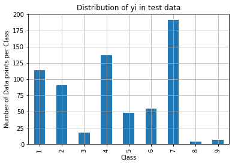


```python
sorted_yi = np.argsort(-test_class_distribution.values)
for i in sorted_yi:
    print('Number of data points in class', i+1, ':',test_class_distribution.values[i], '(', np.round((test_class_distribution.values[i]/test_df.shape[0]*100), 3), '%)')
```

    Number of data points in class 7 : 191 ( 28.722 %)
    Number of data points in class 4 : 137 ( 20.602 %)
    Number of data points in class 1 : 114 ( 17.143 %)
    Number of data points in class 2 : 91 ( 13.684 %)
    Number of data points in class 6 : 55 ( 8.271 %)
    Number of data points in class 5 : 48 ( 7.218 %)
    Number of data points in class 3 : 18 ( 2.707 %)
    Number of data points in class 9 : 7 ( 1.053 %)
    Number of data points in class 8 : 4 ( 0.602 %)


### Visualizing Cross Validation Data


```python
my_colors = 'rgbkymc'
cv_class_distribution.plot(kind='bar')
plt.xlabel('Class')
plt.ylabel('Data points per Class')
plt.title('Distribution of yi in cross validation data')
plt.grid()
plt.show()
```


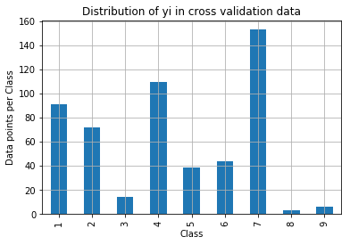


```python
sorted_yi = np.argsort(-train_class_distribution.values)
for i in sorted_yi:
    print('Number of data points in class', i+1, ':',cv_class_distribution.values[i], '(', np.round((cv_class_distribution.values[i]/cv_df.shape[0]*100), 3), '%)')
```

    Number of data points in class 7 : 153 ( 28.759 %)
    Number of data points in class 4 : 110 ( 20.677 %)
    Number of data points in class 1 : 91 ( 17.105 %)
    Number of data points in class 2 : 72 ( 13.534 %)
    Number of data points in class 6 : 44 ( 8.271 %)
    Number of data points in class 5 : 39 ( 7.331 %)
    Number of data points in class 3 : 14 ( 2.632 %)
    Number of data points in class 9 : 6 ( 1.128 %)
    Number of data points in class 8 : 3 ( 0.564 %)


# We build a random model for comparison later
Any later models need to outperform this random model


```python
test_data_len = test_df.shape[0]
cv_data_len = cv_df.shape[0]

cv_predicted_y = np.zeros((cv_data_len,9))
for i in range(cv_data_len):
    rand_probs = np.random.rand(1,9)
    cv_predicted_y[i] = ((rand_probs/sum(sum(rand_probs)))[0])
print("Log loss on Cross Validation Data using Random Model",log_loss(y_cv,cv_predicted_y, eps=1e-15))
#Log loss is undefined for p=0 or p=1, so probabilities are clipped to max(eps, min(1 - eps, p)).
```

    Log loss on Cross Validation Data using Random Model 2.4698426177365795


```python
test_predicted_y = np.zeros((test_data_len,9))
for i in range(test_data_len):
    rand_probs = np.random.rand(1,9)
    test_predicted_y[i] = ((rand_probs/sum(sum(rand_probs)))[0])
print("Log loss on Test Data using Random Model",log_loss(y_test,test_predicted_y, eps=1e-15))
```

    Log loss on Test Data using Random Model 2.50259934643933


```python
predicted_y =np.argmax(test_predicted_y, axis=1)
```


```python
predicted_y + 1 # show the most probable class of cancer
```


    array([3, 9, 7, 4, 8, 5, 9, 8, 2, 5, 1, 8, 2, 6, 1, 8, 6, 7, 7, 9, 1, 9,
           4, 1, 9, 4, 6, 8, 9, 9, 8, 5, 5, 8, 1, 2, 5, 1, 9, 2, 8, 7, 8, 5,
           9, 2, 2, 1, 5, 3, 7, 1, 6, 6, 6, 9, 4, 4, 5, 1, 6, 2, 7, 6, 5, 2,
           4, 5, 4, 7, 9, 5, 7, 2, 2, 7, 3, 8, 5, 6, 4, 1, 2, 4, 4, 2, 6, 6,
           1, 1, 5, 4, 9, 4, 6, 9, 3, 4, 2, 2, 3, 4, 5, 7, 7, 3, 7, 9, 6, 7,
           7, 7, 7, 1, 4, 7, 2, 2, 2, 6, 5, 2, 4, 2, 1, 8, 6, 5, 7, 3, 4, 4,
           6, 3, 5, 5, 6, 9, 7, 9, 8, 8, 9, 7, 4, 6, 4, 1, 6, 2, 1, 6, 9, 7,
           6, 3, 7, 3, 1, 3, 8, 8, 2, 8, 9, 9, 7, 9, 6, 7, 3, 3, 3, 2, 4, 8,
           8, 8, 7, 3, 1, 9, 4, 3, 6, 8, 4, 6, 9, 8, 5, 4, 7, 6, 1, 1, 6, 5,
           4, 2, 9, 6, 6, 9, 1, 8, 1, 3, 1, 5, 3, 1, 1, 2, 8, 8, 3, 7, 3, 9,
           2, 7, 3, 9, 1, 5, 6, 5, 6, 7, 3, 9, 1, 1, 7, 2, 4, 3, 6, 5, 2, 3,
           9, 3, 9, 8, 8, 5, 8, 5, 5, 6, 6, 3, 7, 8, 6, 4, 1, 6, 8, 5, 3, 6,
           6, 6, 5, 8, 5, 8, 5, 9, 6, 1, 4, 5, 6, 5, 3, 8, 7, 9, 9, 8, 1, 3,
           8, 9, 7, 5, 6, 5, 7, 5, 2, 6, 7, 5, 3, 3, 2, 1, 8, 7, 1, 1, 7, 3,
           5, 3, 1, 1, 3, 3, 5, 3, 9, 2, 9, 4, 2, 8, 1, 7, 8, 9, 3, 1, 7, 4,
           1, 2, 5, 2, 9, 6, 1, 8, 7, 4, 8, 3, 6, 6, 8, 6, 6, 8, 8, 5, 9, 4,
           5, 2, 6, 8, 9, 3, 2, 3, 6, 5, 2, 8, 9, 4, 1, 3, 9, 6, 8, 7, 3, 1,
           5, 6, 1, 6, 7, 7, 5, 6, 3, 4, 9, 7, 6, 4, 8, 3, 7, 9, 3, 2, 1, 5,
           6, 1, 8, 8, 7, 1, 4, 5, 7, 2, 9, 9, 4, 3, 2, 6, 7, 8, 4, 4, 6, 1,
           1, 9, 4, 8, 2, 5, 3, 2, 8, 2, 9, 9, 5, 1, 2, 4, 7, 5, 9, 9, 4, 7,
           5, 3, 6, 9, 2, 5, 5, 6, 5, 8, 2, 5, 1, 3, 4, 6, 1, 1, 3, 7, 1, 4,
           1, 7, 3, 9, 3, 4, 2, 3, 4, 7, 3, 5, 7, 2, 2, 4, 5, 2, 9, 1, 8, 1,
           9, 4, 2, 5, 2, 2, 2, 8, 8, 1, 8, 4, 2, 7, 3, 8, 2, 1, 4, 1, 1, 8,
           2, 5, 4, 4, 4, 8, 3, 5, 9, 4, 9, 1, 2, 5, 5, 5, 9, 9, 9, 1, 1, 8,
           4, 8, 7, 4, 3, 6, 3, 2, 9, 9, 6, 3, 9, 6, 3, 3, 8, 7, 2, 2, 9, 1,
           1, 3, 4, 9, 6, 8, 3, 5, 8, 5, 5, 5, 3, 7, 9, 6, 9, 3, 1, 5, 5, 7,
           4, 4, 2, 6, 9, 2, 3, 8, 9, 5, 5, 4, 7, 1, 7, 4, 1, 2, 6, 2, 7, 9,
           2, 6, 2, 5, 7, 8, 6, 8, 7, 3, 7, 1, 7, 7, 5, 9, 1, 9, 5, 4, 3, 1,
           2, 3, 1, 4, 4, 8, 9, 4, 8, 4, 5, 4, 7, 4, 8, 7, 1, 7, 3, 1, 7, 3,
           5, 3, 3, 3, 9, 2, 5, 5, 3, 7, 6, 6, 7, 4, 9, 8, 2, 5, 6, 7, 4, 4,
           8, 5, 8, 2, 5])


#### Confusion Matrix


```python
C = confusion_matrix(y_test, predicted_y)
```


```python
labels = [1,2,3,4,5,6,7,8,9]
plt.figure(figsize=(20,7))
sns.heatmap(C, annot=True, cmap="YlGnBu", fmt=".3f", xticklabels=labels, yticklabels=labels)
plt.xlabel('Predicted Class')
plt.ylabel('Original Class')
plt.show()
```


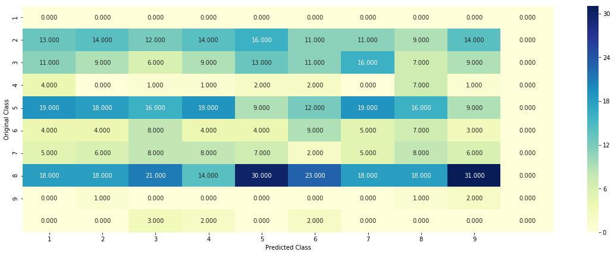


#### Precision Matrix


```python
B =(C/C.sum(axis=0))

plt.figure(figsize=(20,7))
sns.heatmap(B, annot=True, cmap="YlGnBu", fmt=".3f", xticklabels=labels, yticklabels=labels)
plt.xlabel('Predicted Class')
plt.ylabel('Original Class')
plt.show()
```


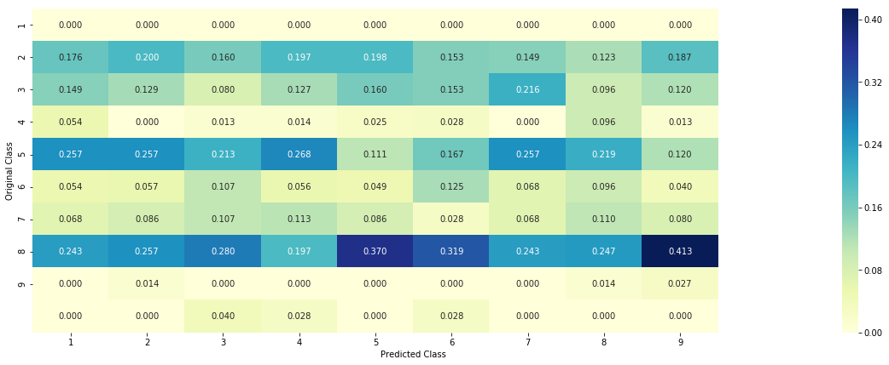


#### Recall Martrix


```python
A =(((C.T)/(C.sum(axis=1))).T)

plt.figure(figsize=(20,7))
sns.heatmap(A, annot=True, cmap="YlGnBu", fmt=".3f", xticklabels=labels, yticklabels=labels)
plt.xlabel('Predicted Class')
plt.ylabel('Original Class')
plt.show()
```


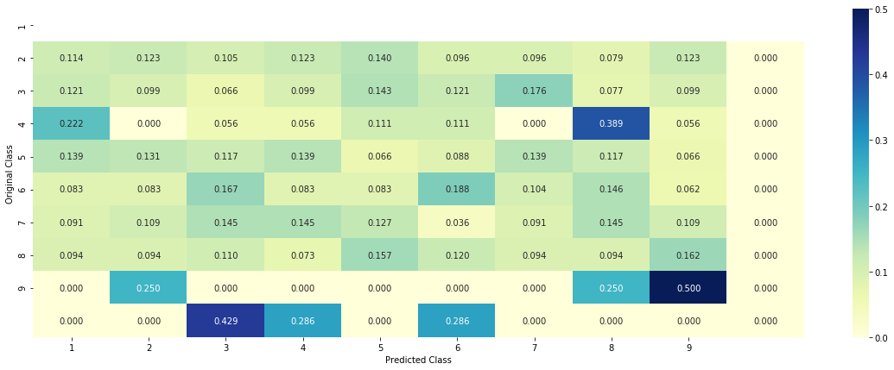


## Evaluating Gene Column


```python
unique_genes = train_df['Gene'].value_counts()
print('Number of Unique Genes :', unique_genes.shape[0])
# the top 10 genes that occured most
print(unique_genes.head(10))
```

    Number of Unique Genes : 233
    BRCA1     162
    TP53      103
    EGFR       90
    PTEN       83
    BRCA2      81
    KIT        64
    BRAF       57
    ALK        48
    PDGFRA     45
    ERBB2      41
    Name: Gene, dtype: int64


```python
s = sum(unique_genes.values);
h = unique_genes.values/s;
c = np.cumsum(h)
plt.plot(c,label='Cumulative distribution of Genes')
plt.grid()
plt.legend()
plt.show()
```


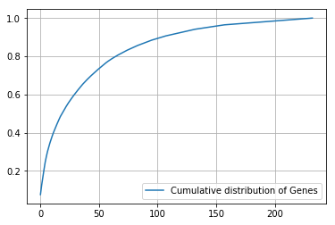


We need to convert categorical variable into something machine can make sense of, we can use:

1. ***One-hot encoding*** 
2. ***Response Encoding*** (Mean imputation) 


```python
# one-hot encoding of Gene feature.
gene_vectorizer = CountVectorizer()
train_gene_feature_onehotCoding = gene_vectorizer.fit_transform(train_df['Gene'])
test_gene_feature_onehotCoding = gene_vectorizer.transform(test_df['Gene'])
cv_gene_feature_onehotCoding = gene_vectorizer.transform(cv_df['Gene'])
```


```python
train_gene_feature_onehotCoding.shape
# 2124 data points, 233 unique genes
```


    (2124, 233)


```python
#column names after one-hot encoding for Gene column
gene_vectorizer.get_feature_names()
```


    ['abl1',
     'acvr1',
     'ago2',
     'akt1',
     'akt2',
     'akt3',
     'alk',
     'apc',
     'ar',
     'araf',
     'arid1b',
     'arid5b',
     'asxl1',
     'atm',
     'atr',
     'atrx',
     'aurka',
     'aurkb',
     'axl',
     'b2m',
     'bap1',
     'bard1',
     'bcl10',
     'bcl2',
     'bcl2l11',
     'bcor',
     'braf',
     'brca1',
     'brca2',
     'brd4',
     'brip1',
     'btk',
     'card11',
     'casp8',
     'cbl',
     'ccnd1',
     'ccnd3',
     'ccne1',
     'cdh1',
     'cdk12',
     'cdk4',
     'cdk6',
     'cdk8',
     'cdkn1a',
     'cdkn1b',
     'cdkn2a',
     'cdkn2b',
     'cdkn2c',
     'cebpa',
     'chek2',
     'cic',
     'crebbp',
     'ctcf',
     'ctla4',
     'ctnnb1',
     'ddr2',
     'dicer1',
     'dnmt3a',
     'dnmt3b',
     'dusp4',
     'egfr',
     'elf3',
     'ep300',
     'epas1',
     'epcam',
     'erbb2',
     'erbb3',
     'erbb4',
     'ercc2',
     'ercc3',
     'ercc4',
     'erg',
     'esr1',
     'etv1',
     'etv6',
     'ewsr1',
     'ezh2',
     'fam58a',
     'fanca',
     'fat1',
     'fbxw7',
     'fgf4',
     'fgfr1',
     'fgfr2',
     'fgfr3',
     'fgfr4',
     'flt1',
     'flt3',
     'foxa1',
     'foxl2',
     'foxo1',
     'foxp1',
     'fubp1',
     'gata3',
     'gli1',
     'gna11',
     'gnaq',
     'gnas',
     'h3f3a',
     'hist1h1c',
     'hla',
     'hnf1a',
     'hras',
     'idh1',
     'idh2',
     'igf1r',
     'ikzf1',
     'il7r',
     'jak1',
     'jak2',
     'jun',
     'kdm5a',
     'kdm5c',
     'kdm6a',
     'kdr',
     'keap1',
     'kit',
     'kmt2a',
     'kmt2b',
     'kmt2c',
     'kmt2d',
     'knstrn',
     'kras',
     'lats1',
     'lats2',
     'map2k1',
     'map2k2',
     'map2k4',
     'map3k1',
     'mdm2',
     'mdm4',
     'med12',
     'mef2b',
     'men1',
     'met',
     'mga',
     'mlh1',
     'mpl',
     'msh2',
     'msh6',
     'mtor',
     'myc',
     'mycn',
     'myd88',
     'myod1',
     'ncor1',
     'nf1',
     'nf2',
     'nfe2l2',
     'nfkbia',
     'nkx2',
     'notch1',
     'notch2',
     'npm1',
     'nras',
     'nsd1',
     'ntrk1',
     'ntrk2',
     'ntrk3',
     'pax8',
     'pbrm1',
     'pdgfra',
     'pdgfrb',
     'pik3ca',
     'pik3cb',
     'pik3cd',
     'pik3r1',
     'pik3r2',
     'pik3r3',
     'pim1',
     'pms1',
     'pms2',
     'pole',
     'ppm1d',
     'ppp2r1a',
     'ppp6c',
     'prdm1',
     'ptch1',
     'pten',
     'ptpn11',
     'ptprd',
     'ptprt',
     'rab35',
     'rac1',
     'rad21',
     'rad50',
     'rad51b',
     'rad51d',
     'rad54l',
     'raf1',
     'rasa1',
     'rb1',
     'rbm10',
     'ret',
     'rheb',
     'rhoa',
     'rit1',
     'rnf43',
     'ros1',
     'rras2',
     'runx1',
     'sdhb',
     'setd2',
     'sf3b1',
     'smad2',
     'smad3',
     'smad4',
     'smarca4',
     'smarcb1',
     'smo',
     'sos1',
     'sox9',
     'spop',
     'src',
     'stat3',
     'stk11',
     'tcf7l2',
     'tert',
     'tet1',
     'tet2',
     'tgfbr1',
     'tgfbr2',
     'tmprss2',
     'tp53',
     'tp53bp1',
     'tsc1',
     'tsc2',
     'u2af1',
     'vegfa',
     'vhl',
     'whsc1',
     'whsc1l1',
     'yap1']


```python
# code for response coding with Laplace smoothing.
# alpha : used for laplace smoothing
# feature: ['gene', 'variation']
# df: ['train_df', 'test_df', 'cv_df']
# algorithm
# ----------
# Consider all unique values and the number of occurances of given feature in train data dataframe
# build a vector (1*9) , the first element = (number of times it occured in class1 + 10*alpha / number of time it occurred in total data+90*alpha)
# gv_dict is like a look up table, for every gene it store a (1*9) representation of it
# for a value of feature in df:
# if it is in train data:
# we add the vector that was stored in 'gv_dict' look up table to 'gv_fea'
# if it is not there is train:
# we add [1/9, 1/9, 1/9, 1/9,1/9, 1/9, 1/9, 1/9, 1/9] to 'gv_fea'
# return 'gv_fea'
# ----------------------

# get_gv_fea_dict: Get Gene varaition Feature Dict
def get_gv_fea_dict(alpha, feature, df):
    # value_count: it contains a dict like
    # print(train_df['Gene'].value_counts())
    # output:
    #        {BRCA1      174
    #         TP53       106
    #         EGFR        86
    #         BRCA2       75
    #         PTEN        69
    #         KIT         61
    #         BRAF        60
    #         ERBB2       47
    #         PDGFRA      46
    #         ...}
    # print(train_df['Variation'].value_counts())
    # output:
    # {
    # Truncating_Mutations                     63
    # Deletion                                 43
    # Amplification                            43
    # Fusions                                  22
    # Overexpression                            3
    # E17K                                      3
    # Q61L                                      3
    # S222D                                     2
    # P130S                                     2
    # ...
    # }
    value_count = train_df[feature].value_counts()
    
    # gv_dict : Gene Variation Dict, which contains the probability array for each gene/variation
    gv_dict = dict()
    
    # denominator will contain the number of time that particular feature occured in whole data
    for i, denominator in value_count.items():
        # vec will contain (p(yi==1/Gi) probability of gene/variation belongs to perticular class
        # vec is 9 diamensional vector
        vec = []
        for k in range(1,10):
            # print(train_df.loc[(train_df['Class']==1) & (train_df['Gene']=='BRCA1')])
            #         ID   Gene             Variation  Class  
            # 2470  2470  BRCA1                S1715C      1   
            # 2486  2486  BRCA1                S1841R      1   
            # 2614  2614  BRCA1                   M1R      1   
            # 2432  2432  BRCA1                L1657P      1   
            # 2567  2567  BRCA1                T1685A      1   
            # 2583  2583  BRCA1                E1660G      1   
            # 2634  2634  BRCA1                W1718L      1   
            # cls_cnt.shape[0] will return the number of rows

            cls_cnt = train_df.loc[(train_df['Class']==k) & (train_df[feature]==i)]
            
            # cls_cnt.shape[0](numerator) will contain the number of time that particular feature occured in whole data
            vec.append((cls_cnt.shape[0] + alpha*10)/ (denominator + 90*alpha))

        # we are adding the gene/variation to the dict as key and vec as value
        gv_dict[i]=vec
    return gv_dict

# Get Gene variation feature
def get_gv_feature(alpha, feature, df):
    # print(gv_dict)
    #     {'BRCA1': [0.20075757575757575, 0.03787878787878788, 0.068181818181818177, 0.13636363636363635, 0.25, 0.19318181818181818, 0.03787878787878788, 0.03787878787878788, 0.03787878787878788], 
    #      'TP53': [0.32142857142857145, 0.061224489795918366, 0.061224489795918366, 0.27040816326530615, 0.061224489795918366, 0.066326530612244902, 0.051020408163265307, 0.051020408163265307, 0.056122448979591837], 
    #      'EGFR': [0.056818181818181816, 0.21590909090909091, 0.0625, 0.068181818181818177, 0.068181818181818177, 0.0625, 0.34659090909090912, 0.0625, 0.056818181818181816], 
    #      'BRCA2': [0.13333333333333333, 0.060606060606060608, 0.060606060606060608, 0.078787878787878782, 0.1393939393939394, 0.34545454545454546, 0.060606060606060608, 0.060606060606060608, 0.060606060606060608], 
    #      'PTEN': [0.069182389937106917, 0.062893081761006289, 0.069182389937106917, 0.46540880503144655, 0.075471698113207544, 0.062893081761006289, 0.069182389937106917, 0.062893081761006289, 0.062893081761006289], 
    #      'KIT': [0.066225165562913912, 0.25165562913907286, 0.072847682119205295, 0.072847682119205295, 0.066225165562913912, 0.066225165562913912, 0.27152317880794702, 0.066225165562913912, 0.066225165562913912], 
    #      'BRAF': [0.066666666666666666, 0.17999999999999999, 0.073333333333333334, 0.073333333333333334, 0.093333333333333338, 0.080000000000000002, 0.29999999999999999, 0.066666666666666666, 0.066666666666666666],
    #      ...
    #     }
    gv_dict = get_gv_fea_dict(alpha, feature, df)
    # value_count is similar in get_gv_fea_dict
    value_count = train_df[feature].value_counts()
    
    # gv_fea: Gene_variation feature, it will contain the feature for each feature value in the data
    gv_fea = []
    # for every feature values in the given data frame we will check if it is there in the train data then we will add the feature to gv_fea
    # if not we will add [1/9,1/9,1/9,1/9,1/9,1/9,1/9,1/9,1/9] to gv_fea
    for index, row in df.iterrows():
        if row[feature] in dict(value_count).keys():
            gv_fea.append(gv_dict[row[feature]])
        else:
            gv_fea.append([1/9,1/9,1/9,1/9,1/9,1/9,1/9,1/9,1/9])
#             gv_fea.append([-1,-1,-1,-1,-1,-1,-1,-1,-1])
    return gv_fea
```


```python
#response-coding of the Gene feature
# alpha is used for laplace smoothing
alpha = 1
# train gene feature
train_gene_feature_responseCoding = np.array(get_gv_feature(alpha, "Gene", train_df))
# test gene feature
test_gene_feature_responseCoding = np.array(get_gv_feature(alpha, "Gene", test_df))
# cross validation gene feature
cv_gene_feature_responseCoding = np.array(get_gv_feature(alpha, "Gene", cv_df))
```


```python
train_gene_feature_responseCoding.shape
```


    (2124, 9)


Now, question is how good is Gene column feature to predict my 9 classes. One idea could be that we will build model having only gene column with one hot encoder with simple model like Logistic regression. If log loss with only one column Gene comes out to be better than random model, than this feature is important.


```python
# We need a hyperparemeter for SGD classifier.
alpha = [10 ** x for x in range(-5, 1)]
cv_log_error_array=[]
for i in alpha:
    clf = SGDClassifier(alpha=i, penalty='l2', loss='log', random_state=42)
    clf.fit(train_gene_feature_onehotCoding, y_train)
    sig_clf = CalibratedClassifierCV(clf, method="sigmoid")
    sig_clf.fit(train_gene_feature_onehotCoding, y_train)
    predict_y = sig_clf.predict_proba(cv_gene_feature_onehotCoding)
    cv_log_error_array.append(log_loss(y_cv, predict_y, labels=clf.classes_, eps=1e-15))
    print('For values of alpha = ', i, "The log loss is:",log_loss(y_cv, predict_y, labels=clf.classes_, eps=1e-15))
    # alpha controls the size of regularization
```

    For values of alpha =  1e-05 The log loss is: 1.3707022895647016
    For values of alpha =  0.0001 The log loss is: 1.200875750527778
    For values of alpha =  0.001 The log loss is: 1.2211851433510534
    For values of alpha =  0.01 The log loss is: 1.3629827172040139
    For values of alpha =  0.1 The log loss is: 1.4716913422587405
    For values of alpha =  1 The log loss is: 1.5049348257102289


```python
fig, ax = plt.subplots()
ax.plot(alpha, cv_log_error_array,c='g')
for i, txt in enumerate(np.round(cv_log_error_array,3)):
    ax.annotate((alpha[i],np.round(txt,3)), (alpha[i],cv_log_error_array[i]))
plt.grid()
plt.title("Cross Validation Error for each alpha")
plt.xlabel("Alpha i's")
plt.ylabel("Error measure")
plt.show()
```


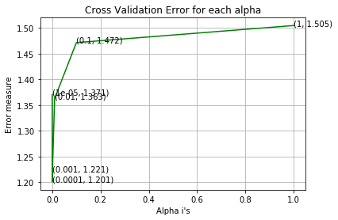


best value of alpha =  0.0001 The log loss is: 1.200875750527778


```python
# Lets use best alpha value as we can see from above graph and compute log loss
best_alpha = np.argmin(cv_log_error_array)
clf = SGDClassifier(alpha=alpha[best_alpha], penalty='l2', loss='log', random_state=42)
clf.fit(train_gene_feature_onehotCoding, y_train)
sig_clf = CalibratedClassifierCV(clf, method="sigmoid")
sig_clf.fit(train_gene_feature_onehotCoding, y_train)

predict_y = sig_clf.predict_proba(train_gene_feature_onehotCoding)
print('For values of best alpha = ', alpha[best_alpha], "The train log loss is:",log_loss(y_train, predict_y, labels=clf.classes_, eps=1e-15))
predict_y = sig_clf.predict_proba(cv_gene_feature_onehotCoding)
print('For values of best alpha = ', alpha[best_alpha], "The cross validation log loss is:",log_loss(y_cv, predict_y, labels=clf.classes_, eps=1e-15))
predict_y = sig_clf.predict_proba(test_gene_feature_onehotCoding)
print('For values of best alpha = ', alpha[best_alpha], "The test log loss is:",log_loss(y_test, predict_y, labels=clf.classes_, eps=1e-15))

```

    For values of best alpha =  0.0001 The train log loss is: 1.060959230114267
    For values of best alpha =  0.0001 The cross validation log loss is: 1.200875750527778
    For values of best alpha =  0.0001 The test log loss is: 1.200161268471548


***We check how many values are overlapping between train, test or between CV and train***


```python
test_coverage=test_df[test_df['Gene'].isin(list(set(train_df['Gene'])))].shape[0]
cv_coverage=cv_df[cv_df['Gene'].isin(list(set(train_df['Gene'])))].shape[0]
```


```python
print('1. In test data',test_coverage, 'out of',test_df.shape[0], ":",(test_coverage/test_df.shape[0])*100)
print('2. In cross validation data',cv_coverage, 'out of ',cv_df.shape[0],":" ,(cv_coverage/cv_df.shape[0])*100)
```

    1. In test data 644 out of 665 : 96.84210526315789
    2. In cross validation data 511 out of  532 : 96.05263157894737


log loss is reduced by just doing a logistic regression on Gene column alone.

## Evaluating Variation Column
We will do similar stuff here with Variation


```python
unique_variations = train_df['Variation'].value_counts()
print('Number of Unique Variations :', unique_variations.shape[0])
# the top 10 variations that occured most
print(unique_variations.head(10))
```

    Number of Unique Variations : 1921
    Truncating_Mutations    59
    Amplification           52
    Deletion                51
    Fusions                 21
    Q61R                     3
    Overexpression           3
    Q61H                     3
    T73I                     2
    Q61L                     2
    Y64A                     2
    Name: Variation, dtype: int64


```python
s = sum(unique_variations.values);
h = unique_variations.values/s;
c = np.cumsum(h)
print(c)
plt.plot(c,label='Cumulative distribution of Variations')
plt.grid()
plt.legend()
plt.show()
```

    [0.02777778 0.05225989 0.07627119 ... 0.99905838 0.99952919 1.        ]


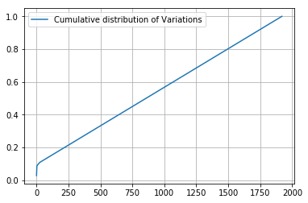


```python
# one-hot encoding of variation feature.
variation_vectorizer = CountVectorizer()
train_variation_feature_onehotCoding = variation_vectorizer.fit_transform(train_df['Variation'])
test_variation_feature_onehotCoding = variation_vectorizer.transform(test_df['Variation'])
cv_variation_feature_onehotCoding = variation_vectorizer.transform(cv_df['Variation'])
```


```python
train_variation_feature_onehotCoding.shape
```


    (2124, 1955)


```python
# alpha is used for laplace smoothing
alpha = 1
# train gene feature
train_variation_feature_responseCoding = np.array(get_gv_feature(alpha, "Variation", train_df))
# test gene feature
test_variation_feature_responseCoding = np.array(get_gv_feature(alpha, "Variation", test_df))
# cross validation gene feature
cv_variation_feature_responseCoding = np.array(get_gv_feature(alpha, "Variation", cv_df))
```


```python
train_variation_feature_responseCoding.shape
```


    (2124, 9)


```python
alpha = [10 ** x for x in range(-5, 1)]
cv_log_error_array=[]
for i in alpha:
    clf = SGDClassifier(alpha=i, penalty='l2', loss='log', random_state=42)
    clf.fit(train_variation_feature_onehotCoding, y_train)
    
    sig_clf = CalibratedClassifierCV(clf, method="sigmoid")
    sig_clf.fit(train_variation_feature_onehotCoding, y_train)
    predict_y = sig_clf.predict_proba(cv_variation_feature_onehotCoding)
    
    cv_log_error_array.append(log_loss(y_cv, predict_y, labels=clf.classes_, eps=1e-15))
    print('For values of alpha = ', i, "The log loss is:",log_loss(y_cv, predict_y, labels=clf.classes_, eps=1e-15))
```

    For values of alpha =  1e-05 The log loss is: 1.7118151583385606
    For values of alpha =  0.0001 The log loss is: 1.6974381345763545
    For values of alpha =  0.001 The log loss is: 1.6995382743687082
    For values of alpha =  0.01 The log loss is: 1.7134596473999466
    For values of alpha =  0.1 The log loss is: 1.720655660825776
    For values of alpha =  1 The log loss is: 1.7210573645406


```python
fig, ax = plt.subplots()
ax.plot(alpha, cv_log_error_array,c='g')
for i, txt in enumerate(np.round(cv_log_error_array,3)):
    ax.annotate((alpha[i],np.round(txt,3)), (alpha[i],cv_log_error_array[i]))
plt.grid()
plt.title("Cross Validation Error for each alpha")
plt.xlabel("Alpha i's")
plt.ylabel("Error measure")
plt.show()
```


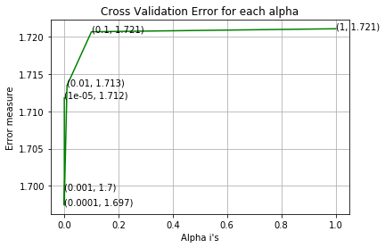


```python
best_alpha = np.argmin(cv_log_error_array)
clf = SGDClassifier(alpha=alpha[best_alpha], penalty='l2', loss='log', random_state=42)
clf.fit(train_variation_feature_onehotCoding, y_train)
sig_clf = CalibratedClassifierCV(clf, method="sigmoid")
sig_clf.fit(train_variation_feature_onehotCoding, y_train)

predict_y = sig_clf.predict_proba(train_variation_feature_onehotCoding)
print('For values of best alpha = ', alpha[best_alpha], "The train log loss is:",log_loss(y_train, predict_y, labels=clf.classes_, eps=1e-15))
predict_y = sig_clf.predict_proba(cv_variation_feature_onehotCoding)
print('For values of best alpha = ', alpha[best_alpha], "The cross validation log loss is:",log_loss(y_cv, predict_y, labels=clf.classes_, eps=1e-15))
predict_y = sig_clf.predict_proba(test_variation_feature_onehotCoding)
print('For values of best alpha = ', alpha[best_alpha], "The test log loss is:",log_loss(y_test, predict_y, labels=clf.classes_, eps=1e-15))
```

    For values of best alpha =  0.0001 The train log loss is: 0.8032900202783516
    For values of best alpha =  0.0001 The cross validation log loss is: 1.6974381345763545
    For values of best alpha =  0.0001 The test log loss is: 1.721592642823517


```python
test_coverage=test_df[test_df['Variation'].isin(list(set(train_df['Variation'])))].shape[0]
cv_coverage=cv_df[cv_df['Variation'].isin(list(set(train_df['Variation'])))].shape[0]
print('1. In test data',test_coverage, 'out of',test_df.shape[0], ":",(test_coverage/test_df.shape[0])*100)
print('2. In cross validation data',cv_coverage, 'out of ',cv_df.shape[0],":" ,(cv_coverage/cv_df.shape[0])*100)
```

    1. In test data 61 out of 665 : 9.172932330827068
    2. In cross validation data 61 out of  532 : 11.466165413533833


Seems like the Gene column is slightly more important? We can't be sure yet, move on to Text.

## Evaluating Text column

More NLP incoming.


```python
def extract_dictionary_paddle(cls_text):
    dictionary = defaultdict(int)
    for index, row in cls_text.iterrows():
        for word in row['TEXT'].split():
            dictionary[word] +=1
    return dictionary
```


```python
import math
#https://stackoverflow.com/a/1602964
def get_text_responsecoding(df):
    text_feature_responseCoding = np.zeros((df.shape[0],9))
    for i in range(0,9):
        row_index = 0
        for index, row in df.iterrows():
            sum_prob = 0
            for word in row['TEXT'].split():
                sum_prob += math.log(((dict_list[i].get(word,0)+10 )/(total_dict.get(word,0)+90)))
            text_feature_responseCoding[row_index][i] = math.exp(sum_prob/len(row['TEXT'].split()))
            row_index += 1
    return text_feature_responseCoding
```


```python
# building a CountVectorizer with all the words that occured minimum 3 times in train data
text_vectorizer = CountVectorizer(min_df=3)
train_text_feature_onehotCoding = text_vectorizer.fit_transform(train_df['TEXT'])
# getting all the feature names (words)
train_text_features= text_vectorizer.get_feature_names()

# train_text_feature_onehotCoding.sum(axis=0).A1 will sum every row and returns (1*number of features) vector
train_text_fea_counts = train_text_feature_onehotCoding.sum(axis=0).A1

# zip(list(text_features),text_fea_counts) will zip a word with its number of times it occured
text_fea_dict = dict(zip(list(train_text_features),train_text_fea_counts))


print("Total number of unique words in train data :", len(train_text_features))
```

    Total number of unique words in train data : 53824


```python
dict_list = []
# dict_list =[] contains 9 dictoinaries each corresponds to a class
for i in range(1,10):
    cls_text = train_df[train_df['Class']==i]
    # build a word dict based on the words in that class
    dict_list.append(extract_dictionary_paddle(cls_text))
    # append it to dict_list

# dict_list[i] is build on i'th  class text data
# total_dict is buid on whole training text data
total_dict = extract_dictionary_paddle(train_df)


confuse_array = []
for i in train_text_features:
    ratios = []
    max_val = -1
    for j in range(0,9):
        ratios.append((dict_list[j][i]+10 )/(total_dict[i]+90))
    confuse_array.append(ratios)
confuse_array = np.array(confuse_array)
```


```python
#response coding of text features
train_text_feature_responseCoding  = get_text_responsecoding(train_df)
test_text_feature_responseCoding  = get_text_responsecoding(test_df)
cv_text_feature_responseCoding  = get_text_responsecoding(cv_df)
```


```python
# https://stackoverflow.com/a/16202486
# we convert each row values such that they sum to 1  
train_text_feature_responseCoding = (train_text_feature_responseCoding.T/train_text_feature_responseCoding.sum(axis=1)).T
test_text_feature_responseCoding = (test_text_feature_responseCoding.T/test_text_feature_responseCoding.sum(axis=1)).T
cv_text_feature_responseCoding = (cv_text_feature_responseCoding.T/cv_text_feature_responseCoding.sum(axis=1)).T
```


```python
# don't forget to normalize every feature
train_text_feature_onehotCoding = normalize(train_text_feature_onehotCoding, axis=0)

# we use the same vectorizer that was trained on train data
test_text_feature_onehotCoding = text_vectorizer.transform(test_df['TEXT'])
# don't forget to normalize every feature
test_text_feature_onehotCoding = normalize(test_text_feature_onehotCoding, axis=0)

# we use the same vectorizer that was trained on train data
cv_text_feature_onehotCoding = text_vectorizer.transform(cv_df['TEXT'])
# don't forget to normalize every feature
cv_text_feature_onehotCoding = normalize(cv_text_feature_onehotCoding, axis=0)
```


```python
#https://stackoverflow.com/a/2258273/4084039
sorted_text_fea_dict = dict(sorted(text_fea_dict.items(), key=lambda x: x[1] , reverse=True))
sorted_text_occur = np.array(list(sorted_text_fea_dict.values()))
```


```python
# Number of words for a given frequency.
print(Counter(sorted_text_occur))
```

    Counter({3: 5730, 4: 3499, 6: 3037, 5: 2888, 8: 2023, 7: 1808, 10: 1733, 9: 1609, 12: 1242, 11: 1167, 13: 1020, 15: 973, 14: 854, 16: 783, 18: 680, 20: 640, 17: 637, 24: 593, 21: 533, 19: 500, 22: 478, 23: 422, 27: 411, 40: 394, 26: 360, 32: 347, 30: 339, 28: 338, 25: 338, 50: 283, 33: 260, 31: 259, 29: 257, 36: 251, 42: 245, 35: 236, 37: 231, 39: 224, 34: 222, 45: 217, 38: 204, 48: 198, 44: 190, 41: 167, 52: 166, 43: 166, 56: 162, 51: 162, 49: 154, 46: 154, 54: 143, 57: 140, 47: 140, 60: 135, 53: 129, 55: 128, 58: 127, 64: 126, 62: 125, 63: 117, 90: 115, 59: 108, 67: 104, 66: 104, 65: 104, 70: 103, 80: 95, 74: 92, 61: 91, 77: 90, 73: 90, 68: 89, 79: 88, 71: 88, 72: 87, 76: 81, 84: 78, 75: 78, 69: 77, 95: 75, 81: 75, 85: 72, 100: 71, 92: 71, 78: 71, 96: 68, 82: 68, 91: 66, 105: 65, 86: 64, 109: 63, 87: 63, 83: 61, 135: 58, 104: 58, 101: 57, 88: 57, 89: 56, 110: 55, 108: 55, 93: 55, 115: 54, 94: 53, 118: 50, 120: 49, 112: 47, 103: 47, 117: 46, 106: 46, 114: 45, 107: 45, 99: 45, 113: 44, 124: 43, 116: 43, 97: 43, 150: 41, 140: 41, 125: 41, 98: 41, 132: 40, 102: 40, 129: 39, 126: 39, 123: 39, 145: 38, 144: 38, 137: 38, 128: 38, 155: 37, 168: 35, 146: 35, 138: 35, 127: 35, 111: 35, 162: 34, 142: 34, 134: 34, 143: 33, 149: 32, 156: 31, 139: 31, 133: 31, 121: 31, 190: 30, 186: 30, 171: 30, 151: 30, 141: 30, 136: 30, 131: 30, 130: 30, 122: 30, 148: 29, 160: 28, 159: 28, 152: 28, 147: 28, 194: 27, 180: 27, 166: 27, 161: 27, 154: 27, 119: 27, 228: 26, 211: 26, 164: 26, 153: 26, 213: 25, 181: 25, 239: 24, 207: 24, 204: 24, 175: 24, 165: 24, 224: 23, 217: 23, 216: 23, 212: 23, 200: 23, 189: 23, 184: 23, 170: 23, 221: 22, 210: 22, 192: 22, 187: 22, 182: 22, 172: 22, 167: 22, 163: 22, 158: 22, 157: 22, 302: 21, 230: 21, 220: 21, 206: 21, 198: 21, 177: 21, 174: 21, 240: 20, 222: 20, 196: 20, 185: 20, 173: 20, 269: 19, 226: 19, 191: 19, 188: 19, 183: 19, 169: 19, 336: 18, 283: 18, 260: 18, 245: 18, 214: 18, 209: 18, 203: 18, 201: 18, 199: 18, 279: 17, 270: 17, 249: 17, 238: 17, 229: 17, 219: 17, 202: 17, 195: 17, 179: 17, 176: 17, 297: 16, 250: 16, 248: 16, 215: 16, 208: 16, 205: 16, 197: 16, 303: 15, 285: 15, 271: 15, 256: 15, 244: 15, 243: 15, 227: 15, 178: 15, 325: 14, 324: 14, 294: 14, 290: 14, 287: 14, 278: 14, 261: 14, 247: 14, 242: 14, 236: 14, 232: 14, 231: 14, 225: 14, 193: 14, 399: 13, 319: 13, 309: 13, 300: 13, 298: 13, 296: 13, 295: 13, 286: 13, 274: 13, 266: 13, 237: 13, 223: 13, 463: 12, 368: 12, 322: 12, 304: 12, 291: 12, 277: 12, 272: 12, 265: 12, 258: 12, 257: 12, 255: 12, 252: 12, 234: 12, 233: 12, 218: 12, 403: 11, 386: 11, 354: 11, 343: 11, 342: 11, 323: 11, 320: 11, 315: 11, 313: 11, 299: 11, 292: 11, 289: 11, 276: 11, 273: 11, 268: 11, 264: 11, 263: 11, 253: 11, 235: 11, 447: 10, 434: 10, 421: 10, 400: 10, 387: 10, 378: 10, 367: 10, 350: 10, 345: 10, 333: 10, 332: 10, 321: 10, 318: 10, 311: 10, 307: 10, 288: 10, 284: 10, 259: 10, 254: 10, 251: 10, 246: 10, 779: 9, 708: 9, 466: 9, 440: 9, 437: 9, 423: 9, 393: 9, 391: 9, 390: 9, 379: 9, 376: 9, 374: 9, 361: 9, 360: 9, 357: 9, 340: 9, 335: 9, 334: 9, 329: 9, 328: 9, 317: 9, 316: 9, 306: 9, 305: 9, 281: 9, 275: 9, 267: 9, 241: 9, 582: 8, 494: 8, 487: 8, 486: 8, 485: 8, 482: 8, 461: 8, 442: 8, 425: 8, 417: 8, 404: 8, 394: 8, 384: 8, 362: 8, 352: 8, 351: 8, 344: 8, 339: 8, 330: 8, 326: 8, 314: 8, 312: 8, 301: 8, 293: 8, 280: 8, 262: 8, 969: 7, 766: 7, 685: 7, 645: 7, 587: 7, 575: 7, 574: 7, 552: 7, 546: 7, 543: 7, 536: 7, 534: 7, 528: 7, 517: 7, 509: 7, 507: 7, 479: 7, 458: 7, 454: 7, 449: 7, 445: 7, 438: 7, 435: 7, 431: 7, 422: 7, 416: 7, 406: 7, 405: 7, 397: 7, 388: 7, 375: 7, 372: 7, 370: 7, 365: 7, 364: 7, 353: 7, 349: 7, 347: 7, 346: 7, 327: 7, 1179: 6, 785: 6, 715: 6, 707: 6, 704: 6, 686: 6, 671: 6, 660: 6, 654: 6, 651: 6, 646: 6, 636: 6, 610: 6, 604: 6, 568: 6, 562: 6, 558: 6, 525: 6, 505: 6, 493: 6, 484: 6, 483: 6, 477: 6, 475: 6, 468: 6, 464: 6, 459: 6, 457: 6, 453: 6, 444: 6, 432: 6, 429: 6, 424: 6, 419: 6, 410: 6, 409: 6, 408: 6, 396: 6, 392: 6, 389: 6, 385: 6, 382: 6, 380: 6, 369: 6, 366: 6, 356: 6, 355: 6, 348: 6, 338: 6, 331: 6, 310: 6, 308: 6, 282: 6, 1451: 5, 1254: 5, 1074: 5, 986: 5, 908: 5, 844: 5, 833: 5, 815: 5, 746: 5, 737: 5, 736: 5, 735: 5, 718: 5, 714: 5, 682: 5, 681: 5, 679: 5, 669: 5, 665: 5, 650: 5, 649: 5, 628: 5, 625: 5, 624: 5, 616: 5, 601: 5, 594: 5, 581: 5, 570: 5, 565: 5, 563: 5, 555: 5, 554: 5, 551: 5, 544: 5, 542: 5, 539: 5, 538: 5, 531: 5, 530: 5, 526: 5, 504: 5, 502: 5, 501: 5, 498: 5, 490: 5, 481: 5, 480: 5, 478: 5, 474: 5, 473: 5, 456: 5, 450: 5, 448: 5, 443: 5, 439: 5, 428: 5, 426: 5, 415: 5, 401: 5, 398: 5, 383: 5, 363: 5, 341: 5, 2097: 4, 1763: 4, 1621: 4, 1611: 4, 1561: 4, 1505: 4, 1394: 4, 1376: 4, 1370: 4, 1317: 4, 1269: 4, 1240: 4, 1189: 4, 1139: 4, 1109: 4, 1079: 4, 1043: 4, 1022: 4, 997: 4, 991: 4, 988: 4, 966: 4, 956: 4, 953: 4, 912: 4, 898: 4, 893: 4, 884: 4, 868: 4, 866: 4, 864: 4, 856: 4, 841: 4, 827: 4, 824: 4, 813: 4, 807: 4, 805: 4, 804: 4, 803: 4, 802: 4, 800: 4, 796: 4, 784: 4, 780: 4, 775: 4, 757: 4, 752: 4, 751: 4, 749: 4, 743: 4, 739: 4, 731: 4, 729: 4, 726: 4, 725: 4, 717: 4, 706: 4, 692: 4, 690: 4, 688: 4, 677: 4, 672: 4, 667: 4, 661: 4, 656: 4, 653: 4, 644: 4, 641: 4, 627: 4, 622: 4, 621: 4, 620: 4, 615: 4, 612: 4, 606: 4, 600: 4, 597: 4, 591: 4, 589: 4, 588: 4, 584: 4, 583: 4, 578: 4, 576: 4, 569: 4, 553: 4, 548: 4, 541: 4, 537: 4, 535: 4, 532: 4, 527: 4, 523: 4, 522: 4, 521: 4, 519: 4, 514: 4, 508: 4, 503: 4, 495: 4, 492: 4, 472: 4, 470: 4, 467: 4, 462: 4, 460: 4, 455: 4, 446: 4, 441: 4, 420: 4, 413: 4, 412: 4, 411: 4, 407: 4, 402: 4, 395: 4, 381: 4, 377: 4, 359: 4, 337: 4, 4198: 3, 4074: 3, 3336: 3, 2652: 3, 2466: 3, 2436: 3, 2387: 3, 2361: 3, 2347: 3, 2304: 3, 2188: 3, 2085: 3, 2073: 3, 2007: 3, 1906: 3, 1897: 3, 1883: 3, 1845: 3, 1771: 3, 1618: 3, 1615: 3, 1605: 3, 1592: 3, 1577: 3, 1575: 3, 1567: 3, 1558: 3, 1547: 3, 1486: 3, 1482: 3, 1447: 3, 1426: 3, 1404: 3, 1390: 3, 1361: 3, 1355: 3, 1351: 3, 1348: 3, 1347: 3, 1327: 3, 1307: 3, 1306: 3, 1305: 3, 1304: 3, 1301: 3, 1298: 3, 1294: 3, 1292: 3, 1279: 3, 1277: 3, 1267: 3, 1265: 3, 1263: 3, 1260: 3, 1252: 3, 1232: 3, 1228: 3, 1225: 3, 1217: 3, 1195: 3, 1193: 3, 1181: 3, 1162: 3, 1158: 3, 1148: 3, 1135: 3, 1125: 3, 1120: 3, 1116: 3, 1112: 3, 1099: 3, 1093: 3, 1092: 3, 1089: 3, 1075: 3, 1073: 3, 1056: 3, 1053: 3, 1048: 3, 1038: 3, 1029: 3, 1027: 3, 1014: 3, 1007: 3, 1004: 3, 987: 3, 983: 3, 982: 3, 981: 3, 980: 3, 938: 3, 935: 3, 934: 3, 932: 3, 929: 3, 927: 3, 926: 3, 923: 3, 921: 3, 918: 3, 904: 3, 899: 3, 897: 3, 891: 3, 889: 3, 885: 3, 883: 3, 881: 3, 880: 3, 874: 3, 865: 3, 861: 3, 859: 3, 858: 3, 849: 3, 846: 3, 840: 3, 837: 3, 836: 3, 834: 3, 823: 3, 819: 3, 818: 3, 808: 3, 806: 3, 799: 3, 794: 3, 792: 3, 774: 3, 763: 3, 761: 3, 760: 3, 759: 3, 754: 3, 753: 3, 750: 3, 733: 3, 722: 3, 716: 3, 700: 3, 695: 3, 694: 3, 691: 3, 689: 3, 687: 3, 675: 3, 674: 3, 666: 3, 662: 3, 655: 3, 647: 3, 643: 3, 640: 3, 638: 3, 637: 3, 635: 3, 633: 3, 630: 3, 623: 3, 619: 3, 608: 3, 607: 3, 605: 3, 603: 3, 593: 3, 592: 3, 590: 3, 586: 3, 585: 3, 580: 3, 579: 3, 572: 3, 559: 3, 556: 3, 550: 3, 545: 3, 533: 3, 518: 3, 516: 3, 515: 3, 513: 3, 510: 3, 506: 3, 500: 3, 496: 3, 471: 3, 452: 3, 436: 3, 433: 3, 430: 3, 427: 3, 418: 3, 373: 3, 371: 3, 358: 3, 12688: 2, 12404: 2, 4387: 2, 4278: 2, 4277: 2, 4201: 2, 4193: 2, 4185: 2, 4067: 2, 4028: 2, 4022: 2, 3896: 2, 3884: 2, 3842: 2, 3801: 2, 3797: 2, 3793: 2, 3716: 2, 3700: 2, 3698: 2, 3620: 2, 3613: 2, 3546: 2, 3482: 2, 3409: 2, 3397: 2, 3393: 2, 3390: 2, 3375: 2, 3271: 2, 3243: 2, 3212: 2, 3206: 2, 3156: 2, 3105: 2, 3103: 2, 3033: 2, 3028: 2, 3014: 2, 3008: 2, 3002: 2, 2993: 2, 2881: 2, 2830: 2, 2816: 2, 2806: 2, 2802: 2, 2775: 2, 2773: 2, 2703: 2, 2702: 2, 2679: 2, 2653: 2, 2649: 2, 2644: 2, 2634: 2, 2522: 2, 2517: 2, 2511: 2, 2495: 2, 2493: 2, 2492: 2, 2481: 2, 2472: 2, 2446: 2, 2422: 2, 2414: 2, 2411: 2, 2358: 2, 2341: 2, 2337: 2, 2322: 2, 2298: 2, 2271: 2, 2265: 2, 2232: 2, 2227: 2, 2218: 2, 2193: 2, 2190: 2, 2185: 2, 2184: 2, 2157: 2, 2123: 2, 2094: 2, 2078: 2, 2075: 2, 2059: 2, 2054: 2, 2039: 2, 2030: 2, 2025: 2, 2020: 2, 2017: 2, 2013: 2, 2012: 2, 1992: 2, 1991: 2, 1990: 2, 1985: 2, 1982: 2, 1974: 2, 1968: 2, 1964: 2, 1941: 2, 1931: 2, 1927: 2, 1925: 2, 1910: 2, 1896: 2, 1894: 2, 1892: 2, 1874: 2, 1870: 2, 1866: 2, 1857: 2, 1843: 2, 1838: 2, 1833: 2, 1808: 2, 1805: 2, 1798: 2, 1796: 2, 1795: 2, 1794: 2, 1790: 2, 1788: 2, 1785: 2, 1784: 2, 1782: 2, 1778: 2, 1768: 2, 1760: 2, 1745: 2, 1744: 2, 1729: 2, 1726: 2, 1707: 2, 1703: 2, 1702: 2, 1697: 2, 1683: 2, 1680: 2, 1668: 2, 1661: 2, 1654: 2, 1652: 2, 1651: 2, 1647: 2, 1646: 2, 1639: 2, 1637: 2, 1627: 2, 1620: 2, 1613: 2, 1612: 2, 1610: 2, 1608: 2, 1603: 2, 1602: 2, 1601: 2, 1589: 2, 1581: 2, 1574: 2, 1571: 2, 1570: 2, 1551: 2, 1548: 2, 1545: 2, 1531: 2, 1523: 2, 1517: 2, 1514: 2, 1513: 2, 1511: 2, 1504: 2, 1490: 2, 1479: 2, 1477: 2, 1448: 2, 1445: 2, 1443: 2, 1440: 2, 1436: 2, 1424: 2, 1418: 2, 1405: 2, 1392: 2, 1389: 2, 1385: 2, 1380: 2, 1378: 2, 1377: 2, 1375: 2, 1369: 2, 1364: 2, 1352: 2, 1344: 2, 1342: 2, 1335: 2, 1332: 2, 1330: 2, 1323: 2, 1319: 2, 1318: 2, 1313: 2, 1303: 2, 1299: 2, 1291: 2, 1287: 2, 1285: 2, 1282: 2, 1259: 2, 1257: 2, 1253: 2, 1247: 2, 1237: 2, 1234: 2, 1231: 2, 1219: 2, 1218: 2, 1215: 2, 1213: 2, 1212: 2, 1207: 2, 1206: 2, 1192: 2, 1191: 2, 1177: 2, 1173: 2, 1172: 2, 1169: 2, 1165: 2, 1151: 2, 1146: 2, 1144: 2, 1143: 2, 1138: 2, 1137: 2, 1130: 2, 1126: 2, 1124: 2, 1123: 2, 1122: 2, 1119: 2, 1113: 2, 1110: 2, 1107: 2, 1104: 2, 1097: 2, 1096: 2, 1095: 2, 1094: 2, 1082: 2, 1072: 2, 1067: 2, 1060: 2, 1052: 2, 1051: 2, 1045: 2, 1042: 2, 1037: 2, 1035: 2, 1032: 2, 1031: 2, 1030: 2, 1028: 2, 1024: 2, 1023: 2, 1020: 2, 1010: 2, 1009: 2, 1008: 2, 1003: 2, 1001: 2, 998: 2, 984: 2, 977: 2, 975: 2, 974: 2, 972: 2, 968: 2, 965: 2, 963: 2, 962: 2, 960: 2, 957: 2, 952: 2, 947: 2, 945: 2, 943: 2, 940: 2, 939: 2, 936: 2, 931: 2, 930: 2, 920: 2, 916: 2, 915: 2, 914: 2, 913: 2, 909: 2, 907: 2, 906: 2, 905: 2, 903: 2, 902: 2, 896: 2, 894: 2, 890: 2, 888: 2, 879: 2, 877: 2, 873: 2, 872: 2, 871: 2, 860: 2, 855: 2, 854: 2, 853: 2, 847: 2, 845: 2, 843: 2, 839: 2, 832: 2, 826: 2, 825: 2, 817: 2, 811: 2, 810: 2, 809: 2, 793: 2, 786: 2, 783: 2, 778: 2, 777: 2, 772: 2, 771: 2, 769: 2, 767: 2, 765: 2, 756: 2, 747: 2, 744: 2, 741: 2, 732: 2, 730: 2, 728: 2, 727: 2, 724: 2, 723: 2, 721: 2, 711: 2, 701: 2, 698: 2, 684: 2, 680: 2, 664: 2, 663: 2, 659: 2, 658: 2, 648: 2, 639: 2, 634: 2, 632: 2, 631: 2, 617: 2, 614: 2, 613: 2, 609: 2, 602: 2, 599: 2, 598: 2, 596: 2, 595: 2, 577: 2, 571: 2, 566: 2, 564: 2, 561: 2, 560: 2, 557: 2, 547: 2, 529: 2, 520: 2, 512: 2, 511: 2, 499: 2, 497: 2, 491: 2, 488: 2, 465: 2, 414: 2, 152227: 1, 120823: 1, 82179: 1, 70102: 1, 70001: 1, 67261: 1, 67184: 1, 63569: 1, 63247: 1, 55966: 1, 54653: 1, 51722: 1, 48742: 1, 46654: 1, 46011: 1, 45123: 1, 42777: 1, 41859: 1, 41626: 1, 41565: 1, 41077: 1, 40697: 1, 40359: 1, 38980: 1, 38658: 1, 38114: 1, 36289: 1, 35984: 1, 35983: 1, 35290: 1, 34911: 1, 34110: 1, 33783: 1, 33152: 1, 32591: 1, 31768: 1, 29485: 1, 28489: 1, 28150: 1, 27142: 1, 26398: 1, 26129: 1, 25891: 1, 25553: 1, 25037: 1, 24994: 1, 24834: 1, 24707: 1, 24511: 1, 24440: 1, 23847: 1, 23808: 1, 23082: 1, 22706: 1, 22242: 1, 22185: 1, 22140: 1, 22091: 1, 21307: 1, 21279: 1, 20822: 1, 20625: 1, 20435: 1, 20024: 1, 19776: 1, 19628: 1, 19478: 1, 19249: 1, 19209: 1, 19166: 1, 19074: 1, 18914: 1, 18885: 1, 18712: 1, 18709: 1, 18695: 1, 18450: 1, 18421: 1, 18379: 1, 18226: 1, 18158: 1, 18068: 1, 17948: 1, 17878: 1, 17857: 1, 17777: 1, 17652: 1, 17651: 1, 17592: 1, 17572: 1, 17390: 1, 17329: 1, 17327: 1, 17021: 1, 16964: 1, 16728: 1, 16685: 1, 16324: 1, 16120: 1, 15723: 1, 15714: 1, 15698: 1, 15642: 1, 15639: 1, 15443: 1, 15389: 1, 15351: 1, 15316: 1, 15302: 1, 15241: 1, 15150: 1, 15093: 1, 15037: 1, 14962: 1, 14929: 1, 14790: 1, 14657: 1, 14633: 1, 14536: 1, 14456: 1, 14268: 1, 14146: 1, 14140: 1, 14119: 1, 13946: 1, 13853: 1, 13824: 1, 13818: 1, 13693: 1, 13641: 1, 13612: 1, 13421: 1, 13406: 1, 13315: 1, 13304: 1, 13031: 1, 12981: 1, 12882: 1, 12877: 1, 12852: 1, 12780: 1, 12692: 1, 12690: 1, 12670: 1, 12668: 1, 12655: 1, 12615: 1, 12601: 1, 12591: 1, 12522: 1, 12430: 1, 12417: 1, 12397: 1, 12377: 1, 12363: 1, 12358: 1, 12270: 1, 12244: 1, 12214: 1, 12139: 1, 12092: 1, 12033: 1, 12022: 1, 12011: 1, 11910: 1, 11906: 1, 11847: 1, 11733: 1, 11709: 1, 11664: 1, 11641: 1, 11560: 1, 11539: 1, 11465: 1, 11416: 1, 11350: 1, 11341: 1, 11274: 1, 11259: 1, 11164: 1, 11044: 1, 11041: 1, 10865: 1, 10773: 1, 10617: 1, 10581: 1, 10573: 1, 10526: 1, 10505: 1, 10415: 1, 10391: 1, 10346: 1, 10324: 1, 10312: 1, 10267: 1, 10231: 1, 10141: 1, 10116: 1, 10088: 1, 10067: 1, 10054: 1, 10021: 1, 10019: 1, 10011: 1, 9975: 1, 9918: 1, 9866: 1, 9768: 1, 9748: 1, 9724: 1, 9722: 1, 9717: 1, 9671: 1, 9620: 1, 9602: 1, 9581: 1, 9559: 1, 9437: 1, 9392: 1, 9266: 1, 9256: 1, 9240: 1, 9239: 1, 9235: 1, 9219: 1, 9214: 1, 9197: 1, 9162: 1, 9158: 1, 9109: 1, 9099: 1, 9095: 1, 9034: 1, 9008: 1, 8880: 1, 8805: 1, 8784: 1, 8762: 1, 8756: 1, 8746: 1, 8740: 1, 8716: 1, 8713: 1, 8708: 1, 8647: 1, 8633: 1, 8599: 1, 8578: 1, 8539: 1, 8526: 1, 8509: 1, 8483: 1, 8435: 1, 8428: 1, 8403: 1, 8369: 1, 8298: 1, 8285: 1, 8241: 1, 8208: 1, 8196: 1, 8188: 1, 8141: 1, 8136: 1, 8130: 1, 8093: 1, 8088: 1, 8087: 1, 8057: 1, 8029: 1, 7959: 1, 7954: 1, 7941: 1, 7926: 1, 7922: 1, 7915: 1, 7896: 1, 7879: 1, 7872: 1, 7855: 1, 7852: 1, 7832: 1, 7787: 1, 7768: 1, 7762: 1, 7757: 1, 7706: 1, 7660: 1, 7640: 1, 7631: 1, 7626: 1, 7557: 1, 7556: 1, 7552: 1, 7539: 1, 7530: 1, 7529: 1, 7518: 1, 7495: 1, 7441: 1, 7400: 1, 7398: 1, 7397: 1, 7395: 1, 7387: 1, 7314: 1, 7297: 1, 7291: 1, 7289: 1, 7280: 1, 7279: 1, 7251: 1, 7247: 1, 7242: 1, 7237: 1, 7224: 1, 7223: 1, 7206: 1, 7200: 1, 7181: 1, 7178: 1, 7155: 1, 7137: 1, 7131: 1, 7130: 1, 7123: 1, 7121: 1, 7097: 1, 7080: 1, 7052: 1, 7045: 1, 7042: 1, 6996: 1, 6929: 1, 6907: 1, 6894: 1, 6888: 1, 6867: 1, 6866: 1, 6851: 1, 6817: 1, 6784: 1, 6754: 1, 6752: 1, 6750: 1, 6738: 1, 6724: 1, 6712: 1, 6684: 1, 6682: 1, 6671: 1, 6655: 1, 6630: 1, 6627: 1, 6608: 1, 6599: 1, 6597: 1, 6594: 1, 6587: 1, 6531: 1, 6517: 1, 6515: 1, 6509: 1, 6474: 1, 6465: 1, 6436: 1, 6423: 1, 6419: 1, 6414: 1, 6410: 1, 6393: 1, 6386: 1, 6382: 1, 6364: 1, 6353: 1, 6340: 1, 6324: 1, 6313: 1, 6310: 1, 6297: 1, 6292: 1, 6286: 1, 6275: 1, 6273: 1, 6262: 1, 6231: 1, 6222: 1, 6210: 1, 6194: 1, 6181: 1, 6131: 1, 6124: 1, 6110: 1, 6094: 1, 6089: 1, 6082: 1, 6074: 1, 6046: 1, 6037: 1, 6022: 1, 6009: 1, 6008: 1, 6007: 1, 5983: 1, 5978: 1, 5961: 1, 5957: 1, 5917: 1, 5915: 1, 5889: 1, 5875: 1, 5841: 1, 5824: 1, 5810: 1, 5807: 1, 5806: 1, 5804: 1, 5793: 1, 5791: 1, 5768: 1, 5752: 1, 5748: 1, 5737: 1, 5726: 1, 5723: 1, 5717: 1, 5681: 1, 5676: 1, 5669: 1, 5652: 1, 5628: 1, 5622: 1, 5612: 1, 5563: 1, 5523: 1, 5520: 1, 5518: 1, 5517: 1, 5467: 1, 5465: 1, 5463: 1, 5460: 1, 5444: 1, 5439: 1, 5433: 1, 5410: 1, 5406: 1, 5405: 1, 5403: 1, 5391: 1, 5387: 1, 5385: 1, 5379: 1, 5361: 1, 5356: 1, 5350: 1, 5346: 1, 5324: 1, 5296: 1, 5287: 1, 5280: 1, 5277: 1, 5275: 1, 5272: 1, 5253: 1, 5244: 1, 5238: 1, 5217: 1, 5215: 1, 5205: 1, 5194: 1, 5189: 1, 5180: 1, 5173: 1, 5146: 1, 5145: 1, 5138: 1, 5121: 1, 5096: 1, 5091: 1, 5083: 1, 5075: 1, 5070: 1, 5050: 1, 5046: 1, 5028: 1, 5023: 1, 5014: 1, 5007: 1, 5001: 1, 4997: 1, 4988: 1, 4985: 1, 4984: 1, 4974: 1, 4961: 1, 4952: 1, 4950: 1, 4937: 1, 4931: 1, 4919: 1, 4908: 1, 4902: 1, 4900: 1, 4897: 1, 4882: 1, 4878: 1, 4873: 1, 4847: 1, 4840: 1, 4833: 1, 4827: 1, 4820: 1, 4814: 1, 4809: 1, 4807: 1, 4798: 1, 4787: 1, 4779: 1, 4778: 1, 4768: 1, 4762: 1, 4751: 1, 4750: 1, 4741: 1, 4737: 1, 4727: 1, 4726: 1, 4697: 1, 4690: 1, 4679: 1, 4654: 1, 4652: 1, 4644: 1, 4619: 1, 4613: 1, 4586: 1, 4583: 1, 4579: 1, 4578: 1, 4577: 1, 4570: 1, 4567: 1, 4564: 1, 4553: 1, 4541: 1, 4537: 1, 4536: 1, 4533: 1, 4530: 1, 4529: 1, 4525: 1, 4515: 1, 4512: 1, 4511: 1, 4507: 1, 4503: 1, 4463: 1, 4454: 1, 4441: 1, 4438: 1, 4429: 1, 4423: 1, 4409: 1, 4396: 1, 4383: 1, 4363: 1, 4359: 1, 4337: 1, 4330: 1, 4328: 1, 4321: 1, 4318: 1, 4313: 1, 4311: 1, 4304: 1, 4296: 1, 4286: 1, 4274: 1, 4268: 1, 4251: 1, 4249: 1, 4248: 1, 4245: 1, 4242: 1, 4237: 1, 4229: 1, 4228: 1, 4223: 1, 4218: 1, 4213: 1, 4208: 1, 4195: 1, 4188: 1, 4182: 1, 4181: 1, 4174: 1, 4173: 1, 4165: 1, 4158: 1, 4143: 1, 4125: 1, 4116: 1, 4099: 1, 4095: 1, 4094: 1, 4086: 1, 4077: 1, 4057: 1, 4043: 1, 4019: 1, 4017: 1, 4014: 1, 4012: 1, 4010: 1, 4009: 1, 4000: 1, 3996: 1, 3995: 1, 3988: 1, 3986: 1, 3974: 1, 3972: 1, 3966: 1, 3965: 1, 3958: 1, 3953: 1, 3942: 1, 3920: 1, 3910: 1, 3874: 1, 3871: 1, 3865: 1, 3859: 1, 3848: 1, 3847: 1, 3845: 1, 3838: 1, 3837: 1, 3822: 1, 3820: 1, 3796: 1, 3794: 1, 3792: 1, 3791: 1, 3782: 1, 3781: 1, 3779: 1, 3772: 1, 3765: 1, 3756: 1, 3750: 1, 3749: 1, 3746: 1, 3737: 1, 3734: 1, 3729: 1, 3725: 1, 3718: 1, 3713: 1, 3708: 1, 3706: 1, 3704: 1, 3684: 1, 3677: 1, 3669: 1, 3653: 1, 3648: 1, 3641: 1, 3619: 1, 3612: 1, 3608: 1, 3603: 1, 3600: 1, 3599: 1, 3597: 1, 3591: 1, 3587: 1, 3586: 1, 3584: 1, 3582: 1, 3580: 1, 3579: 1, 3578: 1, 3573: 1, 3572: 1, 3565: 1, 3563: 1, 3556: 1, 3545: 1, 3533: 1, 3532: 1, 3522: 1, 3520: 1, 3518: 1, 3517: 1, 3513: 1, 3511: 1, 3508: 1, 3497: 1, 3496: 1, 3491: 1, 3489: 1, 3487: 1, 3486: 1, 3476: 1, 3474: 1, 3473: 1, 3472: 1, 3470: 1, 3463: 1, 3460: 1, 3450: 1, 3448: 1, 3446: 1, 3444: 1, 3442: 1, 3437: 1, 3434: 1, 3433: 1, 3426: 1, 3425: 1, 3414: 1, 3412: 1, 3411: 1, 3410: 1, 3403: 1, 3394: 1, 3391: 1, 3382: 1, 3381: 1, 3380: 1, 3368: 1, 3363: 1, 3361: 1, 3360: 1, 3357: 1, 3353: 1, 3350: 1, 3348: 1, 3343: 1, 3332: 1, 3322: 1, 3319: 1, 3316: 1, 3314: 1, 3313: 1, 3307: 1, 3306: 1, 3301: 1, 3298: 1, 3283: 1, 3273: 1, 3268: 1, 3244: 1, 3230: 1, 3224: 1, 3222: 1, 3219: 1, 3218: 1, 3215: 1, 3211: 1, 3209: 1, 3200: 1, 3192: 1, 3191: 1, 3190: 1, 3188: 1, 3177: 1, 3175: 1, 3171: 1, 3162: 1, 3157: 1, 3151: 1, 3142: 1, 3135: 1, 3132: 1, 3126: 1, 3122: 1, 3115: 1, 3109: 1, 3106: 1, 3100: 1, 3088: 1, 3086: 1, 3078: 1, 3067: 1, 3063: 1, 3058: 1, 3057: 1, 3047: 1, 3029: 1, 3024: 1, 3015: 1, 3011: 1, 3006: 1, 3003: 1, 3000: 1, 2997: 1, 2995: 1, 2994: 1, 2987: 1, 2984: 1, 2969: 1, 2965: 1, 2960: 1, 2952: 1, 2949: 1, 2946: 1, 2945: 1, 2944: 1, 2940: 1, 2935: 1, 2920: 1, 2915: 1, 2912: 1, 2911: 1, 2904: 1, 2901: 1, 2887: 1, 2883: 1, 2880: 1, 2877: 1, 2876: 1, 2875: 1, 2874: 1, 2865: 1, 2853: 1, 2849: 1, 2844: 1, 2843: 1, 2841: 1, 2839: 1, 2832: 1, 2831: 1, 2818: 1, 2811: 1, 2809: 1, 2796: 1, 2793: 1, 2786: 1, 2785: 1, 2782: 1, 2774: 1, 2772: 1, 2771: 1, 2761: 1, 2756: 1, 2753: 1, 2747: 1, 2740: 1, 2738: 1, 2737: 1, 2736: 1, 2728: 1, 2723: 1, 2721: 1, 2719: 1, 2715: 1, 2709: 1, 2699: 1, 2696: 1, 2694: 1, 2691: 1, 2681: 1, 2672: 1, 2668: 1, 2659: 1, 2657: 1, 2656: 1, 2648: 1, 2646: 1, 2633: 1, 2632: 1, 2631: 1, 2629: 1, 2628: 1, 2625: 1, 2623: 1, 2621: 1, 2615: 1, 2610: 1, 2603: 1, 2601: 1, 2599: 1, 2596: 1, 2595: 1, 2594: 1, 2589: 1, 2587: 1, 2585: 1, 2584: 1, 2572: 1, 2571: 1, 2570: 1, 2569: 1, 2566: 1, 2563: 1, 2562: 1, 2557: 1, 2556: 1, 2553: 1, 2551: 1, 2545: 1, 2541: 1, 2538: 1, 2533: 1, 2531: 1, 2527: 1, 2526: 1, 2518: 1, 2515: 1, 2514: 1, 2509: 1, 2506: 1, 2503: 1, 2502: 1, 2500: 1, 2491: 1, 2488: 1, 2482: 1, 2478: 1, 2475: 1, 2471: 1, 2455: 1, 2454: 1, 2452: 1, 2448: 1, 2445: 1, 2438: 1, 2433: 1, 2431: 1, 2430: 1, 2427: 1, 2425: 1, 2412: 1, 2410: 1, 2407: 1, 2405: 1, 2403: 1, 2399: 1, 2398: 1, 2395: 1, 2390: 1, 2389: 1, 2385: 1, 2381: 1, 2371: 1, 2369: 1, 2368: 1, 2364: 1, 2363: 1, 2355: 1, 2349: 1, 2348: 1, 2346: 1, 2345: 1, 2338: 1, 2334: 1, 2332: 1, 2331: 1, 2329: 1, 2324: 1, 2323: 1, 2310: 1, 2297: 1, 2292: 1, 2290: 1, 2285: 1, 2282: 1, 2279: 1, 2275: 1, 2270: 1, 2269: 1, 2268: 1, 2267: 1, 2266: 1, 2254: 1, 2253: 1, 2251: 1, 2247: 1, 2243: 1, 2239: 1, 2235: 1, 2231: 1, 2225: 1, 2220: 1, 2219: 1, 2215: 1, 2213: 1, 2206: 1, 2205: 1, 2204: 1, 2202: 1, 2201: 1, 2197: 1, 2189: 1, 2180: 1, 2179: 1, 2178: 1, 2175: 1, 2173: 1, 2168: 1, 2167: 1, 2166: 1, 2165: 1, 2164: 1, 2163: 1, 2161: 1, 2158: 1, 2156: 1, 2152: 1, 2150: 1, 2149: 1, 2147: 1, 2145: 1, 2143: 1, 2142: 1, 2137: 1, 2132: 1, 2131: 1, 2127: 1, 2119: 1, 2104: 1, 2103: 1, 2099: 1, 2095: 1, 2091: 1, 2090: 1, 2089: 1, 2084: 1, 2083: 1, 2081: 1, 2080: 1, 2076: 1, 2064: 1, 2052: 1, 2050: 1, 2049: 1, 2048: 1, 2044: 1, 2041: 1, 2038: 1, 2036: 1, 2034: 1, 2019: 1, 2016: 1, 2014: 1, 2010: 1, 2005: 1, 2004: 1, 2003: 1, 2002: 1, 2001: 1, 2000: 1, 1997: 1, 1996: 1, 1988: 1, 1987: 1, 1984: 1, 1977: 1, 1976: 1, 1975: 1, 1973: 1, 1970: 1, 1969: 1, 1966: 1, 1965: 1, 1963: 1, 1962: 1, 1960: 1, 1956: 1, 1953: 1, 1951: 1, 1949: 1, 1946: 1, 1944: 1, 1942: 1, 1938: 1, 1936: 1, 1933: 1, 1929: 1, 1926: 1, 1924: 1, 1920: 1, 1919: 1, 1915: 1, 1914: 1, 1913: 1, 1907: 1, 1891: 1, 1890: 1, 1888: 1, 1885: 1, 1884: 1, 1882: 1, 1878: 1, 1877: 1, 1875: 1, 1873: 1, 1872: 1, 1869: 1, 1861: 1, 1854: 1, 1852: 1, 1851: 1, 1848: 1, 1847: 1, 1846: 1, 1841: 1, 1840: 1, 1829: 1, 1826: 1, 1825: 1, 1818: 1, 1813: 1, 1812: 1, 1809: 1, 1806: 1, 1804: 1, 1803: 1, 1801: 1, 1799: 1, 1797: 1, 1791: 1, 1789: 1, 1787: 1, 1780: 1, 1776: 1, 1772: 1, 1770: 1, 1767: 1, 1759: 1, 1756: 1, 1754: 1, 1753: 1, 1752: 1, 1751: 1, 1750: 1, 1743: 1, 1742: 1, 1739: 1, 1736: 1, 1734: 1, 1733: 1, 1727: 1, 1725: 1, 1724: 1, 1723: 1, 1722: 1, 1719: 1, 1718: 1, 1717: 1, 1716: 1, 1715: 1, 1713: 1, 1712: 1, 1709: 1, 1708: 1, 1704: 1, 1698: 1, 1696: 1, 1695: 1, 1694: 1, 1692: 1, 1689: 1, 1686: 1, 1685: 1, 1684: 1, 1679: 1, 1677: 1, 1671: 1, 1666: 1, 1662: 1, 1660: 1, 1659: 1, 1658: 1, 1655: 1, 1650: 1, 1642: 1, 1641: 1, 1636: 1, 1634: 1, 1628: 1, 1626: 1, 1606: 1, 1600: 1, 1599: 1, 1597: 1, 1595: 1, 1590: 1, 1588: 1, 1587: 1, 1585: 1, 1583: 1, 1578: 1, 1573: 1, 1569: 1, 1564: 1, 1563: 1, 1562: 1, 1560: 1, 1559: 1, 1557: 1, 1556: 1, 1554: 1, 1550: 1, 1543: 1, 1539: 1, 1537: 1, 1536: 1, 1534: 1, 1533: 1, 1532: 1, 1521: 1, 1516: 1, 1515: 1, 1512: 1, 1506: 1, 1501: 1, 1500: 1, 1496: 1, 1495: 1, 1491: 1, 1489: 1, 1488: 1, 1480: 1, 1476: 1, 1473: 1, 1470: 1, 1469: 1, 1468: 1, 1467: 1, 1466: 1, 1463: 1, 1462: 1, 1457: 1, 1456: 1, 1454: 1, 1453: 1, 1452: 1, 1450: 1, 1449: 1, 1444: 1, 1442: 1, 1441: 1, 1439: 1, 1438: 1, 1433: 1, 1432: 1, 1428: 1, 1427: 1, 1425: 1, 1417: 1, 1413: 1, 1406: 1, 1402: 1, 1401: 1, 1400: 1, 1398: 1, 1397: 1, 1393: 1, 1387: 1, 1386: 1, 1384: 1, 1382: 1, 1381: 1, 1373: 1, 1372: 1, 1365: 1, 1363: 1, 1362: 1, 1360: 1, 1359: 1, 1358: 1, 1357: 1, 1356: 1, 1354: 1, 1353: 1, 1350: 1, 1349: 1, 1343: 1, 1340: 1, 1339: 1, 1336: 1, 1329: 1, 1328: 1, 1326: 1, 1325: 1, 1321: 1, 1320: 1, 1316: 1, 1315: 1, 1314: 1, 1310: 1, 1309: 1, 1297: 1, 1296: 1, 1289: 1, 1288: 1, 1286: 1, 1284: 1, 1283: 1, 1281: 1, 1280: 1, 1278: 1, 1275: 1, 1273: 1, 1268: 1, 1266: 1, 1261: 1, 1256: 1, 1251: 1, 1250: 1, 1249: 1, 1248: 1, 1246: 1, 1245: 1, 1244: 1, 1241: 1, 1236: 1, 1235: 1, 1223: 1, 1221: 1, 1220: 1, 1216: 1, 1214: 1, 1205: 1, 1204: 1, 1203: 1, 1201: 1, 1200: 1, 1196: 1, 1194: 1, 1190: 1, 1188: 1, 1187: 1, 1185: 1, 1183: 1, 1180: 1, 1168: 1, 1167: 1, 1164: 1, 1161: 1, 1159: 1, 1157: 1, 1155: 1, 1154: 1, 1153: 1, 1150: 1, 1149: 1, 1147: 1, 1145: 1, 1142: 1, 1136: 1, 1134: 1, 1133: 1, 1132: 1, 1131: 1, 1129: 1, 1127: 1, 1121: 1, 1118: 1, 1114: 1, 1111: 1, 1105: 1, 1101: 1, 1098: 1, 1088: 1, 1087: 1, 1085: 1, 1084: 1, 1081: 1, 1080: 1, 1078: 1, 1076: 1, 1070: 1, 1069: 1, 1066: 1, 1064: 1, 1061: 1, 1055: 1, 1047: 1, 1046: 1, 1040: 1, 1039: 1, 1034: 1, 1033: 1, 1026: 1, 1025: 1, 1021: 1, 1018: 1, 1013: 1, 1011: 1, 1006: 1, 1002: 1, 1000: 1, 999: 1, 995: 1, 994: 1, 990: 1, 989: 1, 985: 1, 978: 1, 971: 1, 970: 1, 967: 1, 961: 1, 959: 1, 955: 1, 954: 1, 950: 1, 946: 1, 944: 1, 941: 1, 937: 1, 925: 1, 924: 1, 919: 1, 917: 1, 910: 1, 901: 1, 895: 1, 886: 1, 882: 1, 878: 1, 869: 1, 863: 1, 852: 1, 851: 1, 842: 1, 838: 1, 835: 1, 831: 1, 830: 1, 829: 1, 828: 1, 821: 1, 820: 1, 816: 1, 814: 1, 812: 1, 801: 1, 798: 1, 795: 1, 791: 1, 790: 1, 789: 1, 787: 1, 782: 1, 781: 1, 770: 1, 768: 1, 762: 1, 758: 1, 755: 1, 748: 1, 742: 1, 740: 1, 734: 1, 720: 1, 719: 1, 713: 1, 712: 1, 710: 1, 709: 1, 703: 1, 702: 1, 699: 1, 696: 1, 693: 1, 683: 1, 678: 1, 676: 1, 673: 1, 670: 1, 657: 1, 629: 1, 626: 1, 618: 1, 611: 1, 573: 1, 567: 1, 549: 1, 524: 1, 489: 1, 476: 1, 469: 1})


```python
cv_log_error_array=[]
for i in alpha:
    clf = SGDClassifier(alpha=i, penalty='l2', loss='log', random_state=42)
    clf.fit(train_text_feature_onehotCoding, y_train)
    
    sig_clf = CalibratedClassifierCV(clf, method="sigmoid")
    sig_clf.fit(train_text_feature_onehotCoding, y_train)
    predict_y = sig_clf.predict_proba(cv_text_feature_onehotCoding)
    cv_log_error_array.append(log_loss(y_cv, predict_y, labels=clf.classes_, eps=1e-15))
    print('For values of alpha = ', i, "The log loss is:",log_loss(y_cv, predict_y, labels=clf.classes_, eps=1e-15))
```

    For values of alpha =  1e-05 The log loss is: 1.3656567538981133
    For values of alpha =  0.0001 The log loss is: 1.3340196299713143
    For values of alpha =  0.001 The log loss is: 1.1767382931499544
    For values of alpha =  0.01 The log loss is: 1.2647021982505822
    For values of alpha =  0.1 The log loss is: 1.5226145186479128
    For values of alpha =  1 The log loss is: 1.7031382974281883


```python
fig, ax = plt.subplots()
ax.plot(alpha, cv_log_error_array,c='g')
for i, txt in enumerate(np.round(cv_log_error_array,3)):
    ax.annotate((alpha[i],np.round(txt,3)), (alpha[i],cv_log_error_array[i]))
plt.grid()
plt.title("Cross Validation Error for each alpha")
plt.xlabel("Alpha i's")
plt.ylabel("Error measure")
plt.show()
```


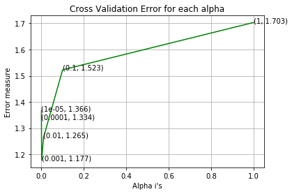


```python
best_alpha = np.argmin(cv_log_error_array)
clf = SGDClassifier(alpha=alpha[best_alpha], penalty='l2', loss='log', random_state=42)
clf.fit(train_text_feature_onehotCoding, y_train)
sig_clf = CalibratedClassifierCV(clf, method="sigmoid")
sig_clf.fit(train_text_feature_onehotCoding, y_train)

predict_y = sig_clf.predict_proba(train_text_feature_onehotCoding)
print('For values of best alpha = ', alpha[best_alpha], "The train log loss is:",log_loss(y_train, predict_y, labels=clf.classes_, eps=1e-15))
predict_y = sig_clf.predict_proba(cv_text_feature_onehotCoding)
print('For values of best alpha = ', alpha[best_alpha], "The cross validation log loss is:",log_loss(y_cv, predict_y, labels=clf.classes_, eps=1e-15))
predict_y = sig_clf.predict_proba(test_text_feature_onehotCoding)
print('For values of best alpha = ', alpha[best_alpha], "The test log loss is:",log_loss(y_test, predict_y, labels=clf.classes_, eps=1e-15))

```

    For values of best alpha =  0.001 The train log loss is: 0.7537623509856216
    For values of best alpha =  0.001 The cross validation log loss is: 1.1767382931499544
    For values of best alpha =  0.001 The test log loss is: 1.1889810970426202


```python
def get_intersec_text(df):
    df_text_vec = CountVectorizer(min_df=3)
    df_text_fea = df_text_vec.fit_transform(df['TEXT'])
    df_text_features = df_text_vec.get_feature_names()

    df_text_fea_counts = df_text_fea.sum(axis=0).A1
    df_text_fea_dict = dict(zip(list(df_text_features),df_text_fea_counts))
    len1 = len(set(df_text_features))
    len2 = len(set(train_text_features) & set(df_text_features))
    return len1,len2
```


```python
len1,len2 = get_intersec_text(test_df)
print(np.round((len2/len1)*100, 3), "% of word of test data appeared in train data")
len1,len2 = get_intersec_text(cv_df)
print(np.round((len2/len1)*100, 3), "% of word of Cross Validation appeared in train data")
```

    96.815 % of word of test data appeared in train data
    98.062 % of word of Cross Validation appeared in train data


Three variables are all important because their log loss all smaller than random.

## Data prepration for Machine Learning models


```python
# Some useful functions we are going to use.
def report_log_loss(train_x, train_y, test_x, test_y,  clf):
    clf.fit(train_x, train_y)
    sig_clf = CalibratedClassifierCV(clf, method="sigmoid")
    sig_clf.fit(train_x, train_y)
    sig_clf_probs = sig_clf.predict_proba(test_x)
    return log_loss(test_y, sig_clf_probs, eps=1e-15)

def plot_confusion_matrix(test_y, predict_y):
    C = confusion_matrix(test_y, predict_y)
    
    A =(((C.T)/(C.sum(axis=1))).T)
    
    B =(C/C.sum(axis=0)) 
    labels = [1,2,3,4,5,6,7,8,9]
    # representing A in heatmap format
    print("-"*20, "Confusion matrix", "-"*20)
    plt.figure(figsize=(20,7))
    sns.heatmap(C, annot=True, cmap="YlGnBu", fmt=".3f", xticklabels=labels, yticklabels=labels)
    plt.xlabel('Predicted Class')
    plt.ylabel('Original Class')
    plt.show()

    print("-"*20, "Precision matrix (Columm Sum=1)", "-"*20)
    plt.figure(figsize=(20,7))
    sns.heatmap(B, annot=True, cmap="YlGnBu", fmt=".3f", xticklabels=labels, yticklabels=labels)
    plt.xlabel('Predicted Class')
    plt.ylabel('Original Class')
    plt.show()
    
    # representing B in heatmap format
    print("-"*20, "Recall matrix (Row sum=1)", "-"*20)
    plt.figure(figsize=(20,7))
    sns.heatmap(A, annot=True, cmap="YlGnBu", fmt=".3f", xticklabels=labels, yticklabels=labels)
    plt.xlabel('Predicted Class')
    plt.ylabel('Original Class')
    plt.show()


def predict_and_plot_confusion_matrix(train_x, train_y,test_x, test_y, clf):
    clf.fit(train_x, train_y)
    sig_clf = CalibratedClassifierCV(clf, method="sigmoid")
    sig_clf.fit(train_x, train_y)
    pred_y = sig_clf.predict(test_x)

    # for calculating log_loss we willl provide the array of probabilities belongs to each class
    print("Log loss :",log_loss(test_y, sig_clf.predict_proba(test_x)))
    # calculating the number of data points that are misclassified
    print("Number of mis-classified points :", np.count_nonzero((pred_y- test_y))/test_y.shape[0])
    plot_confusion_matrix(test_y, pred_y)
    
    
# this function will be used just for naive bayes
# for the given indices, we will print the name of the features
# and we will check whether the feature present in the test point text or not
def get_impfeature_names(indices, text, gene, var, no_features):
    gene_count_vec = CountVectorizer()
    var_count_vec = CountVectorizer()
    text_count_vec = CountVectorizer(min_df=3)
    
    gene_vec = gene_count_vec.fit(train_df['Gene'])
    var_vec  = var_count_vec.fit(train_df['Variation'])
    text_vec = text_count_vec.fit(train_df['TEXT'])
    
    fea1_len = len(gene_vec.get_feature_names())
    fea2_len = len(var_count_vec.get_feature_names())
    
    word_present = 0
    for i,v in enumerate(indices):
        if (v < fea1_len):
            word = gene_vec.get_feature_names()[v]
            yes_no = True if word == gene else False
            if yes_no:
                word_present += 1
                print(i, "Gene feature [{}] present in test data point [{}]".format(word,yes_no))
        elif (v < fea1_len+fea2_len):
            word = var_vec.get_feature_names()[v-(fea1_len)]
            yes_no = True if word == var else False
            if yes_no:
                word_present += 1
                print(i, "variation feature [{}] present in test data point [{}]".format(word,yes_no))
        else:
            word = text_vec.get_feature_names()[v-(fea1_len+fea2_len)]
            yes_no = True if word in text.split() else False
            if yes_no:
                word_present += 1
                print(i, "Text feature [{}] present in test data point [{}]".format(word,yes_no))

    print("Out of the top ",no_features," features ", word_present, "are present in query point")   
```

### Combine Features


```python
train_gene_var_onehotCoding = hstack((train_gene_feature_onehotCoding,train_variation_feature_onehotCoding))
test_gene_var_onehotCoding = hstack((test_gene_feature_onehotCoding,test_variation_feature_onehotCoding))
cv_gene_var_onehotCoding = hstack((cv_gene_feature_onehotCoding,cv_variation_feature_onehotCoding))

train_x_onehotCoding = hstack((train_gene_var_onehotCoding, train_text_feature_onehotCoding)).tocsr()
train_y = np.array(list(train_df['Class']))

test_x_onehotCoding = hstack((test_gene_var_onehotCoding, test_text_feature_onehotCoding)).tocsr()
test_y = np.array(list(test_df['Class']))

cv_x_onehotCoding = hstack((cv_gene_var_onehotCoding, cv_text_feature_onehotCoding)).tocsr()
cv_y = np.array(list(cv_df['Class']))


train_gene_var_responseCoding = np.hstack((train_gene_feature_responseCoding,train_variation_feature_responseCoding))
test_gene_var_responseCoding = np.hstack((test_gene_feature_responseCoding,test_variation_feature_responseCoding))
cv_gene_var_responseCoding = np.hstack((cv_gene_feature_responseCoding,cv_variation_feature_responseCoding))

train_x_responseCoding = np.hstack((train_gene_var_responseCoding, train_text_feature_responseCoding))
test_x_responseCoding = np.hstack((test_gene_var_responseCoding, test_text_feature_responseCoding))
cv_x_responseCoding = np.hstack((cv_gene_var_responseCoding, cv_text_feature_responseCoding))

```


```python
print("One hot encoding features :")
print("(number of data points * number of features) in train data = ", train_x_onehotCoding.shape)
print("(number of data points * number of features) in test data = ", test_x_onehotCoding.shape)
print("(number of data points * number of features) in cross validation data =", cv_x_onehotCoding.shape)
```

    One hot encoding features :
    (number of data points * number of features) in train data =  (2124, 56012)
    (number of data points * number of features) in test data =  (665, 56012)
    (number of data points * number of features) in cross validation data = (532, 56012)


```python
print(" Response encoding features :")
print("(number of data points * number of features) in train data = ", train_x_responseCoding.shape)
print("(number of data points * number of features) in test data = ", test_x_responseCoding.shape)
print("(number of data points * number of features) in cross validation data =", cv_x_responseCoding.shape)
```

     Response encoding features :
    (number of data points * number of features) in train data =  (2124, 27)
    (number of data points * number of features) in test data =  (665, 27)
    (number of data points * number of features) in cross validation data = (532, 27)


# Naive Bayes


```python
alpha = [0.00001, 0.0001, 0.001, 0.1, 1, 10, 100,1000]
cv_log_error_array = []
for i in alpha:
    print("for alpha =", i)
    clf = MultinomialNB(alpha=i)
    clf.fit(train_x_onehotCoding, train_y)
    sig_clf = CalibratedClassifierCV(clf, method="sigmoid")
    sig_clf.fit(train_x_onehotCoding, train_y)
    sig_clf_probs = sig_clf.predict_proba(cv_x_onehotCoding)
    cv_log_error_array.append(log_loss(cv_y, sig_clf_probs, labels=clf.classes_, eps=1e-15))
    # to avoid rounding error while multiplying probabilites we use log-probability estimates
    print("Log Loss :",log_loss(cv_y, sig_clf_probs)) 
```

    for alpha = 1e-05
    Log Loss : 1.2879013516173077
    for alpha = 0.0001
    Log Loss : 1.2789676341367204
    for alpha = 0.001
    Log Loss : 1.2659239581548405
    for alpha = 0.1
    Log Loss : 1.248703487403378
    for alpha = 1
    Log Loss : 1.311884606407117
    for alpha = 10
    Log Loss : 1.4005787699773775
    for alpha = 100
    Log Loss : 1.3865683760199474
    for alpha = 1000
    Log Loss : 1.3289937821311812


```python
fig, ax = plt.subplots()
ax.plot(np.log10(alpha), cv_log_error_array,c='g')
for i, txt in enumerate(np.round(cv_log_error_array,3)):
    ax.annotate((alpha[i],str(txt)), (np.log10(alpha[i]),cv_log_error_array[i]))
plt.grid()
plt.xticks(np.log10(alpha))
plt.title("Cross Validation Error for each alpha")
plt.xlabel("Alpha i's")
plt.ylabel("Error measure")
plt.show()
```


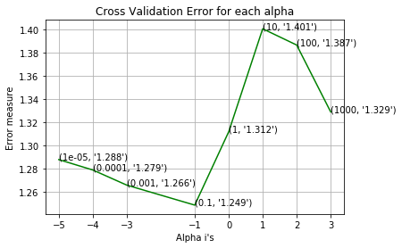


```python
best_alpha = np.argmin(cv_log_error_array)
clf = MultinomialNB(alpha=alpha[best_alpha])
clf.fit(train_x_onehotCoding, train_y)
sig_clf = CalibratedClassifierCV(clf, method="sigmoid")
sig_clf.fit(train_x_onehotCoding, train_y)


predict_y = sig_clf.predict_proba(train_x_onehotCoding)
print('For values of best alpha = ', alpha[best_alpha], "The train log loss is:",log_loss(y_train, predict_y, labels=clf.classes_, eps=1e-15))
predict_y = sig_clf.predict_proba(cv_x_onehotCoding)
print('For values of best alpha = ', alpha[best_alpha], "The cross validation log loss is:",log_loss(y_cv, predict_y, labels=clf.classes_, eps=1e-15))
predict_y = sig_clf.predict_proba(test_x_onehotCoding)
print('For values of best alpha = ', alpha[best_alpha], "The test log loss is:",log_loss(y_test, predict_y, labels=clf.classes_, eps=1e-15))

```

    For values of best alpha =  0.1 The train log loss is: 0.8787876174270516
    For values of best alpha =  0.1 The cross validation log loss is: 1.248703487403378
    For values of best alpha =  0.1 The test log loss is: 1.2559352662497614


```python
clf = MultinomialNB(alpha=alpha[best_alpha])
clf.fit(train_x_onehotCoding, train_y)
sig_clf = CalibratedClassifierCV(clf, method="sigmoid")
sig_clf.fit(train_x_onehotCoding, train_y)
sig_clf_probs = sig_clf.predict_proba(cv_x_onehotCoding)
# to avoid rounding error while multiplying probabilites we use log-probability estimates
print("Log Loss :",log_loss(cv_y, sig_clf_probs))
print("Number of missclassified point :", np.count_nonzero((sig_clf.predict(cv_x_onehotCoding)- cv_y))/cv_y.shape[0])
plot_confusion_matrix(cv_y, sig_clf.predict(cv_x_onehotCoding.toarray()))
```

    Log Loss : 1.248703487403378
    Number of missclassified point : 0.3966165413533835
    -------------------- Confusion matrix --------------------


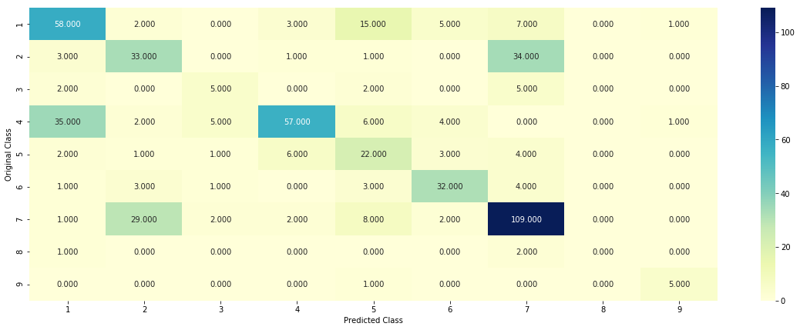


    -------------------- Precision matrix (Columm Sum=1) --------------------


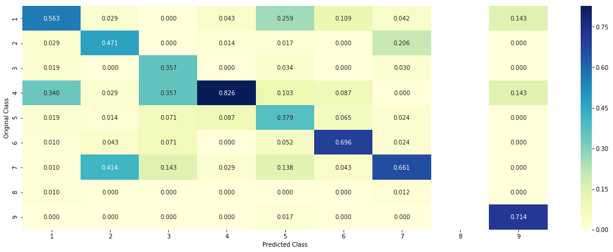


    -------------------- Recall matrix (Row sum=1) --------------------


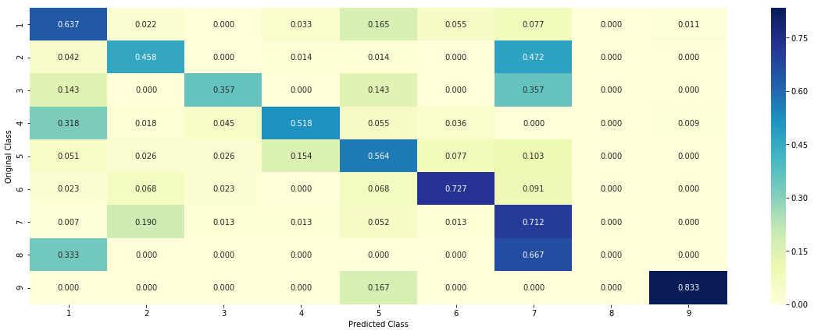


```python
# try to interpret this model, we look at two points.
test_point_index = 3
no_feature = 100
predicted_cls = sig_clf.predict(test_x_onehotCoding[test_point_index])
print("Predicted Class :", predicted_cls[0])
print("Predicted Class Probabilities:", np.round(sig_clf.predict_proba(test_x_onehotCoding[test_point_index]),4))
print("Actual Class :", test_y[test_point_index])
indices = np.argsort(-clf.coef_)[predicted_cls-1][:,:no_feature]
print("-"*50)
get_impfeature_names(indices[0], test_df['TEXT'].iloc[test_point_index],test_df['Gene'].iloc[test_point_index],test_df['Variation'].iloc[test_point_index], no_feature)
```

    Predicted Class : 6
    Predicted Class Probabilities: [[0.0775 0.0722 0.0149 0.1049 0.0327 0.5634 0.1263 0.0038 0.0043]]
    Actual Class : 6
    --------------------------------------------------
    6 Text feature [i2285v] present in test data point [True]
    7 Text feature [ivs13] present in test data point [True]
    8 Text feature [brca] present in test data point [True]
    9 Text feature [ivs5] present in test data point [True]
    10 Text feature [odds] present in test data point [True]
    11 Text feature [i124v] present in test data point [True]
    12 Text feature [falling] present in test data point [True]
    14 Text feature [57] present in test data point [True]
    15 Text feature [ivs8] present in test data point [True]
    16 Text feature [history] present in test data point [True]
    17 Text feature [personal] present in test data point [True]
    18 Text feature [lrs] present in test data point [True]
    19 Text feature [k513r] present in test data point [True]
    20 Text feature [discussionusing] present in test data point [True]
    21 Text feature [specialists] present in test data point [True]
    22 Text feature [caribbean] present in test data point [True]
    23 Text feature [ivs6] present in test data point [True]
    24 Text feature [logistic] present in test data point [True]
    25 Text feature [3098] present in test data point [True]
    26 Text feature [mathjax] present in test data point [True]
    27 Text feature [2all] present in test data point [True]
    28 Text feature [d3170g] present in test data point [True]
    29 Text feature [neutralityllrgene] present in test data point [True]
    30 Text feature [r1028h] present in test data point [True]
    31 Text feature [104brca2] present in test data point [True]
    32 Text feature [reassurance] present in test data point [True]
    33 Text feature [g890v] present in test data point [True]
    34 Text feature [d1280v] present in test data point [True]
    35 Text feature [pedigreeselsewhere] present in test data point [True]
    36 Text feature [onthat] present in test data point [True]
    37 Text feature [overstate] present in test data point [True]
    38 Text feature [v2969m] present in test data point [True]
    39 Text feature [onthis] present in test data point [True]
    40 Text feature [onthenview] present in test data point [True]
    41 Text feature [probandswe] present in test data point [True]
    42 Text feature [probandsor] present in test data point [True]
    43 Text feature [probandsno] present in test data point [True]
    44 Text feature [17g] present in test data point [True]
    45 Text feature [0other] present in test data point [True]
    46 Text feature [invarianta] present in test data point [True]
    47 Text feature [v3079i] present in test data point [True]
    48 Text feature [causalityllrgene] present in test data point [True]
    49 Text feature [c554w] present in test data point [True]
    50 Text feature [q2384k] present in test data point [True]
    51 Text feature [causalitybrca1] present in test data point [True]
    52 Text feature [r2108h] present in test data point [True]
    53 Text feature [i925l] present in test data point [True]
    54 Text feature [methodssource] present in test data point [True]
    55 Text feature [aassessed] present in test data point [True]
    56 Text feature [d642h] present in test data point [True]
    57 Text feature [mvs] present in test data point [True]
    58 Text feature [neutralitybrca1] present in test data point [True]
    59 Text feature [k1109n] present in test data point [True]
    60 Text feature [9345g] present in test data point [True]
    61 Text feature [7235g] present in test data point [True]
    62 Text feature [typehistory] present in test data point [True]
    63 Text feature [onandview] present in test data point [True]
    64 Text feature [d1546y] present in test data point [True]
    65 Text feature [c3198r] present in test data point [True]
    66 Text feature [e1682k] present in test data point [True]
    67 Text feature [10g] present in test data point [True]
    68 Text feature [aspersonal] present in test data point [True]
    69 Text feature [103splice] present in test data point [True]
    70 Text feature [e1419q] present in test data point [True]
    71 Text feature [k862e] present in test data point [True]
    72 Text feature [f1524v] present in test data point [True]
    73 Text feature [f1662s] present in test data point [True]
    74 Text feature [v894i] present in test data point [True]
    75 Text feature [g1194d] present in test data point [True]
    76 Text feature [onwhere] present in test data point [True]
    77 Text feature [q155e] present in test data point [True]
    78 Text feature [108table] present in test data point [True]
    79 Text feature [brca2personal] present in test data point [True]
    80 Text feature [g602r] present in test data point [True]
    81 Text feature [h2074n] present in test data point [True]
    82 Text feature [genotypeethnic] present in test data point [True]
    83 Text feature [ifdi] present in test data point [True]
    84 Text feature [ifdis] present in test data point [True]
    85 Text feature [1225del3] present in test data point [True]
    86 Text feature [mutationsto] present in test data point [True]
    87 Text feature [d806h] present in test data point [True]
    88 Text feature [m1361l] present in test data point [True]
    89 Text feature [k1690n] present in test data point [True]
    90 Text feature [r504h] present in test data point [True]
    91 Text feature [2del21insa] present in test data point [True]
    92 Text feature [k2411t] present in test data point [True]
    93 Text feature [byview] present in test data point [True]
    94 Text feature [37the] present in test data point [True]
    95 Text feature [e597k] present in test data point [True]
    96 Text feature [11delt] present in test data point [True]
    97 Text feature [h1918y] present in test data point [True]
    98 Text feature [m297i] present in test data point [True]
    99 Text feature [q1396r] present in test data point [True]
    Out of the top  100  features  93 are present in query point


```python
test_point_index = 100
no_feature = 100
predicted_cls = sig_clf.predict(test_x_onehotCoding[test_point_index])
print("Predicted Class :", predicted_cls[0])
print("Predicted Class Probabilities:", np.round(sig_clf.predict_proba(test_x_onehotCoding[test_point_index]),4))
print("Actual Class :", test_y[test_point_index])
indices = np.argsort(-clf.coef_)[predicted_cls-1][:,:no_feature]
print("-"*50)
get_impfeature_names(indices[0], test_df['TEXT'].iloc[test_point_index],test_df['Gene'].iloc[test_point_index],test_df['Variation'].iloc[test_point_index], no_feature)
```

    Predicted Class : 7
    Predicted Class Probabilities: [[0.0766 0.0714 0.0147 0.1037 0.0323 0.0361 0.6571 0.0037 0.0042]]
    Actual Class : 7
    --------------------------------------------------
    15 Text feature [downstream] present in test data point [True]
    16 Text feature [presence] present in test data point [True]
    17 Text feature [recently] present in test data point [True]
    18 Text feature [kinase] present in test data point [True]
    21 Text feature [well] present in test data point [True]
    22 Text feature [expressing] present in test data point [True]
    23 Text feature [contrast] present in test data point [True]
    24 Text feature [activating] present in test data point [True]
    25 Text feature [cell] present in test data point [True]
    26 Text feature [cells] present in test data point [True]
    27 Text feature [similar] present in test data point [True]
    28 Text feature [shown] present in test data point [True]
    29 Text feature [independent] present in test data point [True]
    30 Text feature [previously] present in test data point [True]
    31 Text feature [showed] present in test data point [True]
    32 Text feature [higher] present in test data point [True]
    33 Text feature [10] present in test data point [True]
    34 Text feature [treated] present in test data point [True]
    35 Text feature [however] present in test data point [True]
    36 Text feature [found] present in test data point [True]
    37 Text feature [potential] present in test data point [True]
    38 Text feature [growth] present in test data point [True]
    39 Text feature [also] present in test data point [True]
    40 Text feature [inhibitor] present in test data point [True]
    41 Text feature [approximately] present in test data point [True]
    42 Text feature [compared] present in test data point [True]
    43 Text feature [addition] present in test data point [True]
    44 Text feature [factor] present in test data point [True]
    45 Text feature [activation] present in test data point [True]
    46 Text feature [suggest] present in test data point [True]
    47 Text feature [described] present in test data point [True]
    48 Text feature [may] present in test data point [True]
    49 Text feature [total] present in test data point [True]
    50 Text feature [respectively] present in test data point [True]
    51 Text feature [obtained] present in test data point [True]
    52 Text feature [12] present in test data point [True]
    53 Text feature [various] present in test data point [True]
    54 Text feature [reported] present in test data point [True]
    57 Text feature [mutations] present in test data point [True]
    58 Text feature [enhanced] present in test data point [True]
    59 Text feature [observed] present in test data point [True]
    60 Text feature [concentrations] present in test data point [True]
    61 Text feature [inhibited] present in test data point [True]
    62 Text feature [studies] present in test data point [True]
    63 Text feature [inhibition] present in test data point [True]
    64 Text feature [furthermore] present in test data point [True]
    65 Text feature [followed] present in test data point [True]
    66 Text feature [1a] present in test data point [True]
    67 Text feature [interestingly] present in test data point [True]
    68 Text feature [including] present in test data point [True]
    69 Text feature [without] present in test data point [True]
    70 Text feature [new] present in test data point [True]
    71 Text feature [identified] present in test data point [True]
    72 Text feature [suggests] present in test data point [True]
    73 Text feature [small] present in test data point [True]
    74 Text feature [leading] present in test data point [True]
    75 Text feature [different] present in test data point [True]
    76 Text feature [two] present in test data point [True]
    77 Text feature [3a] present in test data point [True]
    78 Text feature [occur] present in test data point [True]
    79 Text feature [either] present in test data point [True]
    80 Text feature [consistent] present in test data point [True]
    81 Text feature [fig] present in test data point [True]
    82 Text feature [using] present in test data point [True]
    84 Text feature [report] present in test data point [True]
    85 Text feature [constitutive] present in test data point [True]
    86 Text feature [confirmed] present in test data point [True]
    87 Text feature [15] present in test data point [True]
    88 Text feature [proliferation] present in test data point [True]
    89 Text feature [although] present in test data point [True]
    90 Text feature [thus] present in test data point [True]
    91 Text feature [hours] present in test data point [True]
    92 Text feature [high] present in test data point [True]
    93 Text feature [whereas] present in test data point [True]
    94 Text feature [molecular] present in test data point [True]
    95 Text feature [phosphorylation] present in test data point [True]
    96 Text feature [due] present in test data point [True]
    97 Text feature [three] present in test data point [True]
    98 Text feature [despite] present in test data point [True]
    99 Text feature [sensitive] present in test data point [True]
    Out of the top  100  features  80 are present in query point


# KNN


```python
alpha = [5, 11, 15, 21, 31, 41, 51, 99]
cv_log_error_array = []
for i in alpha:
    print("for alpha =", i)
    clf = KNeighborsClassifier(n_neighbors=i)
    clf.fit(train_x_responseCoding, train_y)
    sig_clf = CalibratedClassifierCV(clf, method="sigmoid")
    sig_clf.fit(train_x_responseCoding, train_y)
    sig_clf_probs = sig_clf.predict_proba(cv_x_responseCoding)
    cv_log_error_array.append(log_loss(cv_y, sig_clf_probs, labels=clf.classes_, eps=1e-15))
    # to avoid rounding error while multiplying probabilites we use log-probability estimates
    print("Log Loss :",log_loss(cv_y, sig_clf_probs))
```

    for alpha = 5
    Log Loss : 1.0529243084269597
    for alpha = 11
    Log Loss : 1.028428032196374
    for alpha = 15
    Log Loss : 1.030805436164078
    for alpha = 21
    Log Loss : 1.0359736091612295
    for alpha = 31
    Log Loss : 1.0629883725688938
    for alpha = 41
    Log Loss : 1.0741245151501786
    for alpha = 51
    Log Loss : 1.082879607967505
    for alpha = 99
    Log Loss : 1.090686224794648


```python
fig, ax = plt.subplots()
ax.plot(alpha, cv_log_error_array,c='g')
for i, txt in enumerate(np.round(cv_log_error_array,3)):
    ax.annotate((alpha[i],str(txt)), (alpha[i],cv_log_error_array[i]))
plt.grid()
plt.title("Cross Validation Error for each alpha")
plt.xlabel("Alpha i's")
plt.ylabel("Error measure")
plt.show()
```


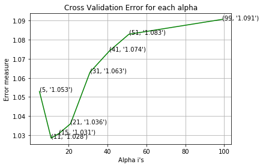


```python
best_alpha = np.argmin(cv_log_error_array)
clf = KNeighborsClassifier(n_neighbors=alpha[best_alpha])
clf.fit(train_x_responseCoding, train_y)
sig_clf = CalibratedClassifierCV(clf, method="sigmoid")
sig_clf.fit(train_x_responseCoding, train_y)

predict_y = sig_clf.predict_proba(train_x_responseCoding)
print('For values of best alpha = ', alpha[best_alpha], "The train log loss is:",log_loss(y_train, predict_y, labels=clf.classes_, eps=1e-15))
predict_y = sig_clf.predict_proba(cv_x_responseCoding)
print('For values of best alpha = ', alpha[best_alpha], "The cross validation log loss is:",log_loss(y_cv, predict_y, labels=clf.classes_, eps=1e-15))
predict_y = sig_clf.predict_proba(test_x_responseCoding)
print('For values of best alpha = ', alpha[best_alpha], "The test log loss is:",log_loss(y_test, predict_y, labels=clf.classes_, eps=1e-15))

```

    For values of best alpha =  11 The train log loss is: 0.641692855125118
    For values of best alpha =  11 The cross validation log loss is: 1.028428032196374
    For values of best alpha =  11 The test log loss is: 1.061970932809428


```python
clf = KNeighborsClassifier(n_neighbors=alpha[best_alpha])
predict_and_plot_confusion_matrix(train_x_responseCoding, train_y, cv_x_responseCoding, cv_y, clf)
```

    Log loss : 1.028428032196374
    Number of mis-classified points : 0.3533834586466165
    -------------------- Confusion matrix --------------------


    -------------------- Precision matrix (Columm Sum=1) --------------------


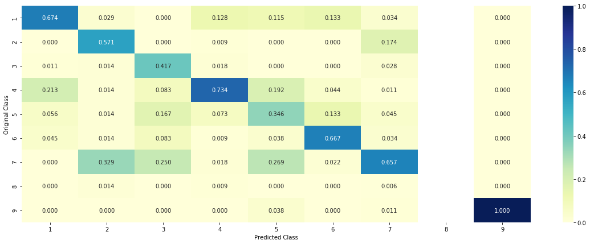


    -------------------- Recall matrix (Row sum=1) --------------------


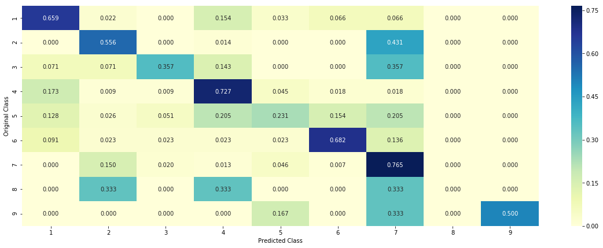


```python
# Lets look at few test points
clf = KNeighborsClassifier(n_neighbors=alpha[best_alpha])
clf.fit(train_x_responseCoding, train_y)
sig_clf = CalibratedClassifierCV(clf, method="sigmoid")
sig_clf.fit(train_x_responseCoding, train_y)

test_point_index = 1
predicted_cls = sig_clf.predict(test_x_responseCoding[0].reshape(1,-1))
print("Predicted Class :", predicted_cls[0])
print("Actual Class :", test_y[test_point_index])
neighbors = clf.kneighbors(test_x_responseCoding[test_point_index].reshape(1, -1), alpha[best_alpha])
print("The ",alpha[best_alpha]," nearest neighbours of the test points belongs to classes",train_y[neighbors[1][0]])
print("Fequency of nearest points :",Counter(train_y[neighbors[1][0]]))
```

    Predicted Class : 4
    Actual Class : 2
    The  11  nearest neighbours of the test points belongs to classes [2 2 2 2 2 2 2 2 2 2 2]
    Fequency of nearest points : Counter({2: 11})


```python
clf = KNeighborsClassifier(n_neighbors=alpha[best_alpha])
clf.fit(train_x_responseCoding, train_y)
sig_clf = CalibratedClassifierCV(clf, method="sigmoid")
sig_clf.fit(train_x_responseCoding, train_y)

test_point_index = 100

predicted_cls = sig_clf.predict(test_x_responseCoding[test_point_index].reshape(1,-1))
print("Predicted Class :", predicted_cls[0])
print("Actual Class :", test_y[test_point_index])
neighbors = clf.kneighbors(test_x_responseCoding[test_point_index].reshape(1, -1), alpha[best_alpha])
print("the k value for knn is",alpha[best_alpha],"and the nearest neighbours of the test points belongs to classes",train_y[neighbors[1][0]])
print("Fequency of nearest points :",Counter(train_y[neighbors[1][0]]))
```

    Predicted Class : 7
    Actual Class : 7
    the k value for knn is 11 and the nearest neighbours of the test points belongs to classes [7 7 7 7 7 7 7 7 7 7 7]
    Fequency of nearest points : Counter({7: 11})


**We know there are 9 classes of cancer though**


```python
clf = KNeighborsClassifier(n_neighbors=9)
predict_and_plot_confusion_matrix(train_x_responseCoding, train_y, cv_x_responseCoding, cv_y, clf)
```

    Log loss : 1.0317600627872971
    Number of mis-classified points : 0.37406015037593987
    -------------------- Confusion matrix --------------------


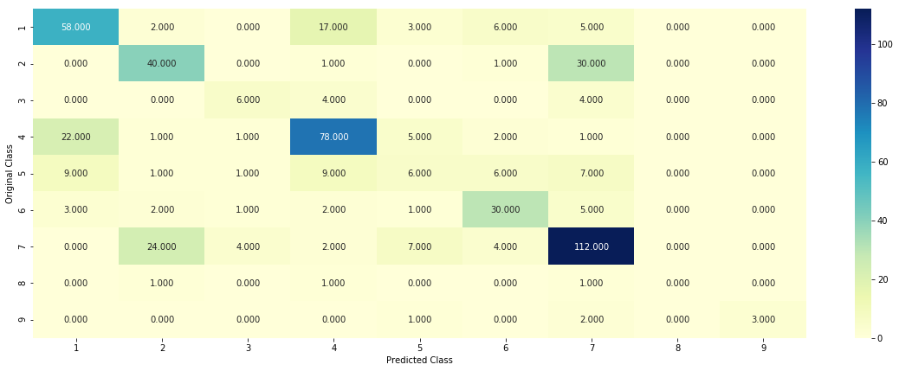


    -------------------- Precision matrix (Columm Sum=1) --------------------


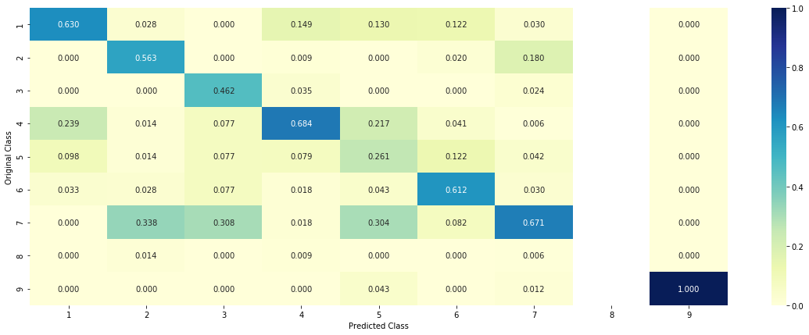


    -------------------- Recall matrix (Row sum=1) --------------------


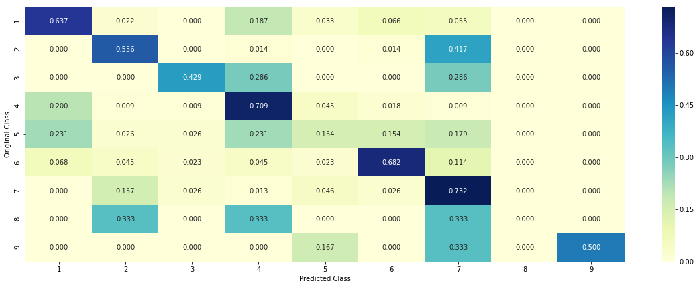


# Logistic Regression

using all features of course.


```python
alpha = [10 ** x for x in range(-6, 3)]
cv_log_error_array = []
for i in alpha:
    print("for alpha =", i)
    clf = SGDClassifier(class_weight='balanced', alpha=i, penalty='l2', loss='log', random_state=42)
    #note the class-wight is balanced!
    clf.fit(train_x_onehotCoding, train_y)
    sig_clf = CalibratedClassifierCV(clf, method="sigmoid")
    sig_clf.fit(train_x_onehotCoding, train_y)
    sig_clf_probs = sig_clf.predict_proba(cv_x_onehotCoding)
    cv_log_error_array.append(log_loss(cv_y, sig_clf_probs, labels=clf.classes_, eps=1e-15))
    # to avoid rounding error while multiplying probabilites we use log-probability estimates
    print("Log Loss :",log_loss(cv_y, sig_clf_probs)) 
```

    for alpha = 1e-06
    Log Loss : 1.3603433440561785
    for alpha = 1e-05
    Log Loss : 1.3798486303449364
    for alpha = 0.0001
    Log Loss : 1.32073841504496
    for alpha = 0.001
    Log Loss : 1.0905562619579783
    for alpha = 0.01
    Log Loss : 1.1510929278004858
    for alpha = 0.1
    Log Loss : 1.5042049945191354
    for alpha = 1
    Log Loss : 1.7161744124310103
    for alpha = 10
    Log Loss : 1.7406857765332842
    for alpha = 100
    Log Loss : 1.7432099438455575


```python
fig, ax = plt.subplots()
ax.plot(alpha, cv_log_error_array,c='g')
for i, txt in enumerate(np.round(cv_log_error_array,3)):
    ax.annotate((alpha[i],str(txt)), (alpha[i],cv_log_error_array[i]))
plt.grid()
plt.title("Cross Validation Error for each alpha")
plt.xlabel("Alpha i's")
plt.ylabel("Error measure")
plt.show()
```


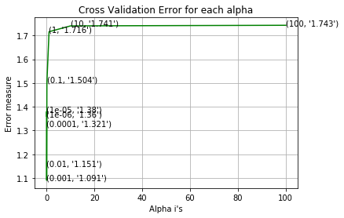


```python
best_alpha = np.argmin(cv_log_error_array)
clf = SGDClassifier(class_weight='balanced', alpha=alpha[best_alpha], penalty='l2', loss='log', random_state=42)
clf.fit(train_x_onehotCoding, train_y)
sig_clf = CalibratedClassifierCV(clf, method="sigmoid")
sig_clf.fit(train_x_onehotCoding, train_y)

predict_y = sig_clf.predict_proba(train_x_onehotCoding)
print('For values of best alpha = ', alpha[best_alpha], "The train log loss is:",log_loss(y_train, predict_y, labels=clf.classes_, eps=1e-15))
predict_y = sig_clf.predict_proba(cv_x_onehotCoding)
print('For values of best alpha = ', alpha[best_alpha], "The cross validation log loss is:",log_loss(y_cv, predict_y, labels=clf.classes_, eps=1e-15))
predict_y = sig_clf.predict_proba(test_x_onehotCoding)
print('For values of best alpha = ', alpha[best_alpha], "The test log loss is:",log_loss(y_test, predict_y, labels=clf.classes_, eps=1e-15))
```

    For values of best alpha =  0.001 The train log loss is: 0.6091218387129371
    For values of best alpha =  0.001 The cross validation log loss is: 1.0905562619579783
    For values of best alpha =  0.001 The test log loss is: 1.087789060821118


```python
clf = SGDClassifier(class_weight='balanced', alpha=alpha[best_alpha], penalty='l2', loss='log', random_state=42)
predict_and_plot_confusion_matrix(train_x_onehotCoding, train_y, cv_x_onehotCoding, cv_y, clf)
```

    Log loss : 1.0905562619579783
    Number of mis-classified points : 0.35902255639097747
    -------------------- Confusion matrix --------------------


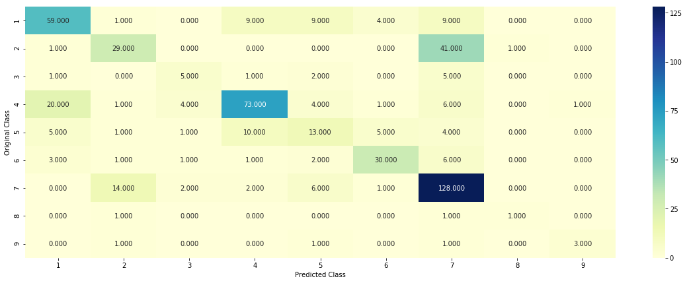


    -------------------- Precision matrix (Columm Sum=1) --------------------


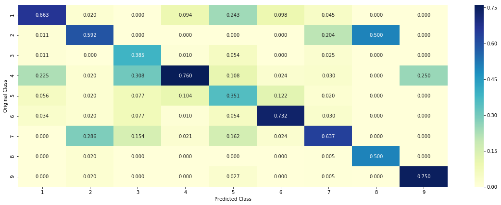


    -------------------- Recall matrix (Row sum=1) --------------------


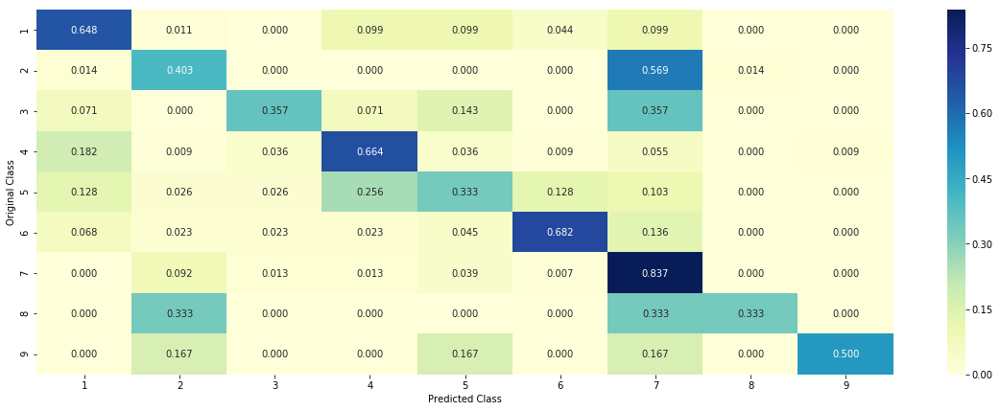


```python
def get_imp_feature_names(text, indices, removed_ind = []):
    word_present = 0
    tabulte_list = []
    incresingorder_ind = 0
    for i in indices:
        if i < train_gene_feature_onehotCoding.shape[1]:
            tabulte_list.append([incresingorder_ind, "Gene", "Yes"])
        elif i< 18:
            tabulte_list.append([incresingorder_ind,"Variation", "Yes"])
        if ((i > 17) & (i not in removed_ind)) :
            word = train_text_features[i]
            yes_no = True if word in text.split() else False
            if yes_no:
                word_present += 1
            tabulte_list.append([incresingorder_ind,train_text_features[i], yes_no])
        incresingorder_ind += 1
    print(word_present, "most importent features are present in our query point")
    print("-"*50)
    print("The features that are most importent of the ",predicted_cls[0]," class:")
    print (tabulate(tabulte_list, headers=["Index",'Feature name', 'Present or Not']))
```


```python
# from tabulate import tabulate
clf = SGDClassifier(class_weight='balanced', alpha=alpha[best_alpha], penalty='l2', loss='log', random_state=42)
clf.fit(train_x_onehotCoding,train_y)
test_point_index = 1
no_feature = 500
predicted_cls = sig_clf.predict(test_x_onehotCoding[test_point_index])
print("Predicted Class :", predicted_cls[0])
print("Predicted Class Probabilities:", np.round(sig_clf.predict_proba(test_x_onehotCoding[test_point_index]),4))
print("Actual Class :", test_y[test_point_index])
indices = np.argsort(-clf.coef_)[predicted_cls-1][:,:no_feature]
print("-"*50)
get_impfeature_names(indices[0], test_df['TEXT'].iloc[test_point_index],test_df['Gene'].iloc[test_point_index],test_df['Variation'].iloc[test_point_index], no_feature)
```

    Predicted Class : 7
    Predicted Class Probabilities: [[0.099  0.2202 0.0155 0.1482 0.0394 0.025  0.4363 0.0061 0.0102]]
    Actual Class : 2
    --------------------------------------------------
    53 Text feature [3t3] present in test data point [True]
    67 Text feature [balb] present in test data point [True]
    87 Text feature [constitutively] present in test data point [True]
    96 Text feature [expressing] present in test data point [True]
    115 Text feature [activated] present in test data point [True]
    182 Text feature [murine] present in test data point [True]
    207 Text feature [proliferate] present in test data point [True]
    210 Text feature [transformed] present in test data point [True]
    218 Text feature [injection] present in test data point [True]
    237 Text feature [transforming] present in test data point [True]
    353 Text feature [pharma] present in test data point [True]
    371 Text feature [injected] present in test data point [True]
    383 Text feature [ba] present in test data point [True]
    393 Text feature [f3] present in test data point [True]
    454 Text feature [activation] present in test data point [True]
    480 Text feature [mpd] present in test data point [True]
    Out of the top  500  features  16 are present in query point


# Linear Support Vector Machines


```python
alpha = [10 ** x for x in range(-5, 3)]
cv_log_error_array = []
for i in alpha:
    print("for C =", i)
#     clf = SVC(C=i,kernel='linear',probability=True, class_weight='balanced')
    clf = SGDClassifier( class_weight='balanced', alpha=i, penalty='l2', loss='hinge', random_state=42)
    clf.fit(train_x_onehotCoding, train_y)
    sig_clf = CalibratedClassifierCV(clf, method="sigmoid")
    sig_clf.fit(train_x_onehotCoding, train_y)
    sig_clf_probs = sig_clf.predict_proba(cv_x_onehotCoding)
    cv_log_error_array.append(log_loss(cv_y, sig_clf_probs, labels=clf.classes_, eps=1e-15))
    print("Log Loss :",log_loss(cv_y, sig_clf_probs)) 

fig, ax = plt.subplots()
ax.plot(alpha, cv_log_error_array,c='g')
for i, txt in enumerate(np.round(cv_log_error_array,3)):
    ax.annotate((alpha[i],str(txt)), (alpha[i],cv_log_error_array[i]))
plt.grid()
plt.title("Cross Validation Error for each alpha")
plt.xlabel("Alpha i's")
plt.ylabel("Error measure")
plt.show()


best_alpha = np.argmin(cv_log_error_array)
# clf = SVC(C=i,kernel='linear',probability=True, class_weight='balanced')
clf = SGDClassifier(class_weight='balanced', alpha=alpha[best_alpha], penalty='l2', loss='hinge', random_state=42)
clf.fit(train_x_onehotCoding, train_y)
sig_clf = CalibratedClassifierCV(clf, method="sigmoid")
sig_clf.fit(train_x_onehotCoding, train_y)

predict_y = sig_clf.predict_proba(train_x_onehotCoding)
print('For values of best alpha = ', alpha[best_alpha], "The train log loss is:",log_loss(y_train, predict_y, labels=clf.classes_, eps=1e-15))
predict_y = sig_clf.predict_proba(cv_x_onehotCoding)
print('For values of best alpha = ', alpha[best_alpha], "The cross validation log loss is:",log_loss(y_cv, predict_y, labels=clf.classes_, eps=1e-15))
predict_y = sig_clf.predict_proba(test_x_onehotCoding)
print('For values of best alpha = ', alpha[best_alpha], "The test log loss is:",log_loss(y_test, predict_y, labels=clf.classes_, eps=1e-15))
```

    for C = 1e-05
    Log Loss : 1.4010101351501059
    for C = 0.0001
    Log Loss : 1.3749833201584838
    for C = 0.001
    Log Loss : 1.2494360986504476
    for C = 0.01
    Log Loss : 1.129000394654712
    for C = 0.1
    Log Loss : 1.3859292941691885
    for C = 1
    Log Loss : 1.7293714319461255
    for C = 10
    Log Loss : 1.7436538601081064
    for C = 100
    Log Loss : 1.7436538659468965


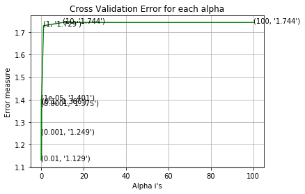


    For values of best alpha =  0.01 The train log loss is: 0.7331176775009127
    For values of best alpha =  0.01 The cross validation log loss is: 1.129000394654712
    For values of best alpha =  0.01 The test log loss is: 1.1513395886513769


```python
clf = SGDClassifier(alpha=alpha[best_alpha], penalty='l2', loss='hinge', random_state=42,class_weight='balanced')
predict_and_plot_confusion_matrix(train_x_onehotCoding, train_y,cv_x_onehotCoding,cv_y, clf)
```

    Log loss : 1.129000394654712
    Number of mis-classified points : 0.36466165413533835
    -------------------- Confusion matrix --------------------


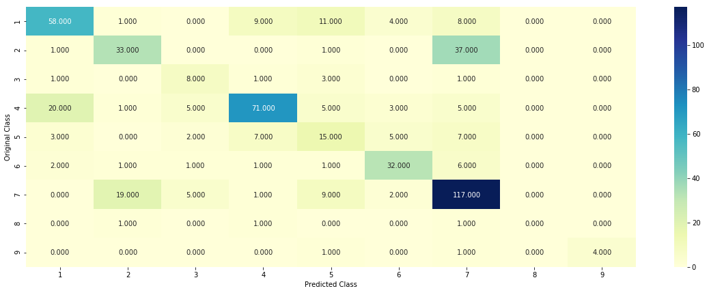


    -------------------- Precision matrix (Columm Sum=1) --------------------


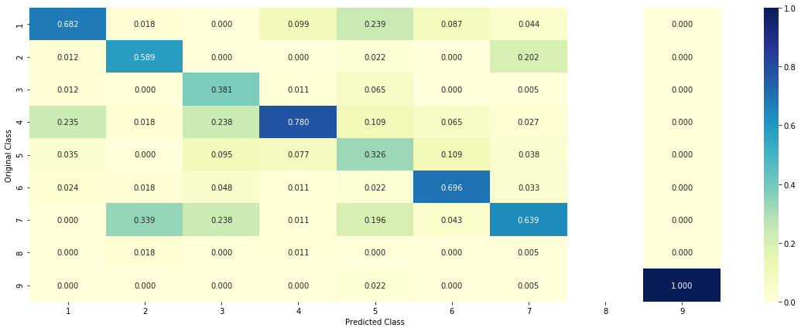


    -------------------- Recall matrix (Row sum=1) --------------------


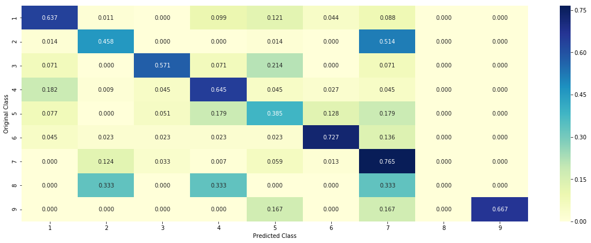


```python
clf = SGDClassifier(alpha=alpha[best_alpha], penalty='l2', loss='hinge', random_state=42)
clf.fit(train_x_onehotCoding,train_y)
test_point_index = 50
# test_point_index = 100
no_feature = 500
predicted_cls = sig_clf.predict(test_x_onehotCoding[test_point_index])
print("Predicted Class :", predicted_cls[0])
print("Predicted Class Probabilities:", np.round(sig_clf.predict_proba(test_x_onehotCoding[test_point_index]),4))
print("Actual Class :", test_y[test_point_index])
indices = np.argsort(-clf.coef_)[predicted_cls-1][:,:no_feature]
print("-"*50)
get_impfeature_names(indices[0], test_df['TEXT'].iloc[test_point_index],test_df['Gene'].iloc[test_point_index],test_df['Variation'].iloc[test_point_index], no_feature)
```

    Predicted Class : 7
    Predicted Class Probabilities: [[0.0286 0.0214 0.0065 0.04   0.0208 0.0131 0.8639 0.0032 0.0026]]
    Actual Class : 7
    --------------------------------------------------
    23 Text feature [subcutaneously] present in test data point [True]
    30 Text feature [expressing] present in test data point [True]
    31 Text feature [3t3] present in test data point [True]
    45 Text feature [constitutive] present in test data point [True]
    136 Text feature [frederick] present in test data point [True]
    148 Text feature [tk] present in test data point [True]
    150 Text feature [activated] present in test data point [True]
    155 Text feature [constitutively] present in test data point [True]
    159 Text feature [buchdunger] present in test data point [True]
    166 Text feature [druker] present in test data point [True]
    205 Text feature [downstream] present in test data point [True]
    211 Text feature [phospho] present in test data point [True]
    213 Text feature [transformed] present in test data point [True]
    256 Text feature [oncogene] present in test data point [True]
    288 Text feature [y1253d] present in test data point [True]
    299 Text feature [doses] present in test data point [True]
    330 Text feature [concentrations] present in test data point [True]
    362 Text feature [submicromolar] present in test data point [True]
    377 Text feature [transduced] present in test data point [True]
    382 Text feature [activation] present in test data point [True]
    399 Text feature [egf] present in test data point [True]
    400 Text feature [morphologies] present in test data point [True]
    421 Text feature [wounded] present in test data point [True]
    446 Text feature [injected] present in test data point [True]
    458 Text feature [graveel] present in test data point [True]
    462 Text feature [interventions] present in test data point [True]
    Out of the top  500  features  26 are present in query point


# Random Forest Classifier


```python
# with one-hot encoding
alpha = [100,200,500,1000,2000]
max_depth = [5, 10]
cv_log_error_array = []
for i in alpha:
    for j in max_depth:
        print("for n_estimators =", i,"and max depth = ", j)
        clf = RandomForestClassifier(n_estimators=i, criterion='gini', max_depth=j, random_state=42, n_jobs=-1)
        clf.fit(train_x_onehotCoding, train_y)
        sig_clf = CalibratedClassifierCV(clf, method="sigmoid")
        sig_clf.fit(train_x_onehotCoding, train_y)
        sig_clf_probs = sig_clf.predict_proba(cv_x_onehotCoding)
        cv_log_error_array.append(log_loss(cv_y, sig_clf_probs, labels=clf.classes_, eps=1e-15))
        print("Log Loss :",log_loss(cv_y, sig_clf_probs)) 

```

    for n_estimators = 100 and max depth =  5
    Log Loss : 1.2863629127202212
    for n_estimators = 100 and max depth =  10
    Log Loss : 1.1898643923370604
    for n_estimators = 200 and max depth =  5
    Log Loss : 1.2715499362141565
    for n_estimators = 200 and max depth =  10
    Log Loss : 1.1885605928616463
    for n_estimators = 500 and max depth =  5
    Log Loss : 1.2581396267403084
    for n_estimators = 500 and max depth =  10
    Log Loss : 1.1794709316380145
    for n_estimators = 1000 and max depth =  5
    Log Loss : 1.256919461702887
    for n_estimators = 1000 and max depth =  10
    Log Loss : 1.1783891542628069
    for n_estimators = 2000 and max depth =  5
    Log Loss : 1.2546575073473354
    for n_estimators = 2000 and max depth =  10
    Log Loss : 1.1734362169375487


```python
best_alpha = np.argmin(cv_log_error_array)
clf = RandomForestClassifier(n_estimators=alpha[int(best_alpha/2)], criterion='gini', max_depth=max_depth[int(best_alpha%2)], random_state=42, n_jobs=-1)
clf.fit(train_x_onehotCoding, train_y)
sig_clf = CalibratedClassifierCV(clf, method="sigmoid")
sig_clf.fit(train_x_onehotCoding, train_y)

predict_y = sig_clf.predict_proba(train_x_onehotCoding)
print('For values of best estimator = ', alpha[int(best_alpha/2)], "The train log loss is:",log_loss(y_train, predict_y, labels=clf.classes_, eps=1e-15))
predict_y = sig_clf.predict_proba(cv_x_onehotCoding)
print('For values of best estimator = ', alpha[int(best_alpha/2)], "The cross validation log loss is:",log_loss(y_cv, predict_y, labels=clf.classes_, eps=1e-15))
predict_y = sig_clf.predict_proba(test_x_onehotCoding)
print('For values of best estimator = ', alpha[int(best_alpha/2)], "The test log loss is:",log_loss(y_test, predict_y, labels=clf.classes_, eps=1e-15))
```

    For values of best estimator =  2000 The train log loss is: 0.7069707591034311
    For values of best estimator =  2000 The cross validation log loss is: 1.1734362169375487
    For values of best estimator =  2000 The test log loss is: 1.1196572715009294


```python
clf = RandomForestClassifier(n_estimators=alpha[int(best_alpha/2)], criterion='gini', max_depth=max_depth[int(best_alpha%2)], random_state=42, n_jobs=-1)
predict_and_plot_confusion_matrix(train_x_onehotCoding, train_y,cv_x_onehotCoding,cv_y, clf)
```

    Log loss : 1.1734362169375487
    Number of mis-classified points : 0.42105263157894735
    -------------------- Confusion matrix --------------------


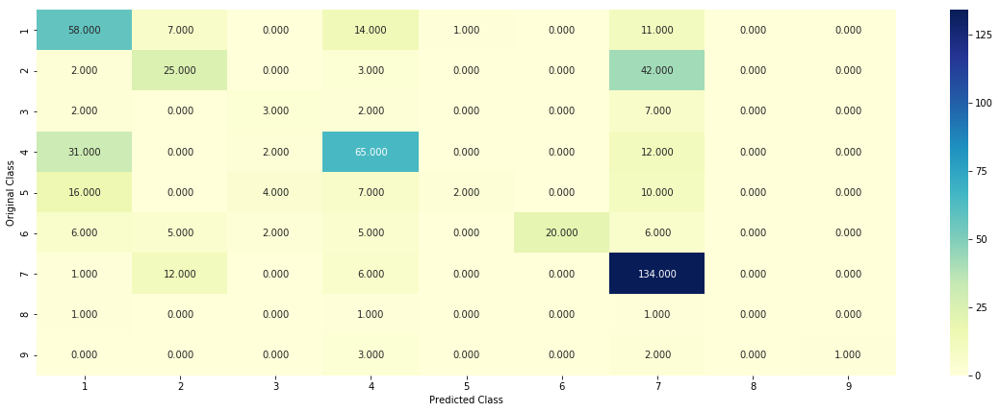


    -------------------- Precision matrix (Columm Sum=1) --------------------


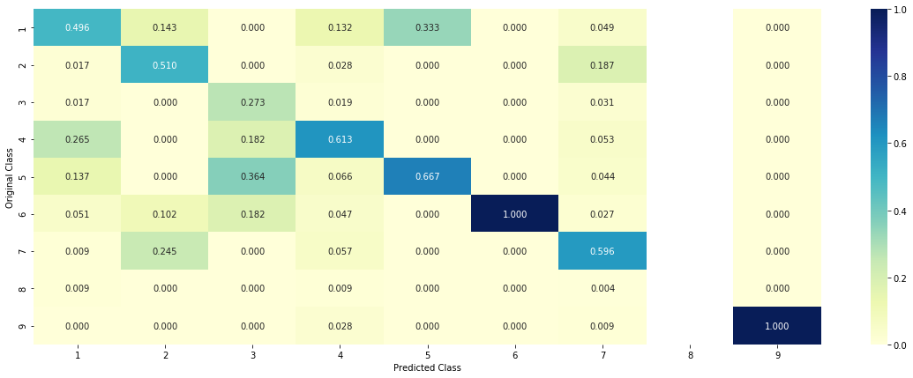


    -------------------- Recall matrix (Row sum=1) --------------------


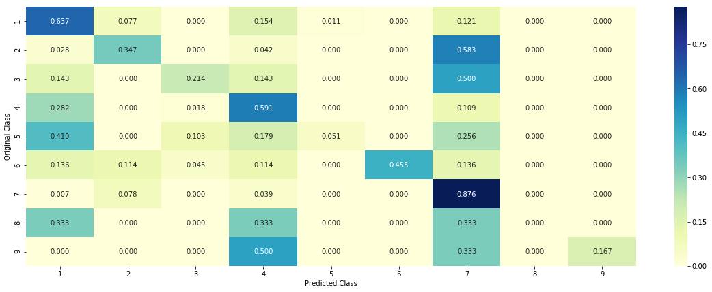


```python
# test_point_index = 10
clf = RandomForestClassifier(n_estimators=alpha[int(best_alpha/2)], criterion='gini', max_depth=max_depth[int(best_alpha%2)], random_state=42, n_jobs=-1)
clf.fit(train_x_onehotCoding, train_y)
sig_clf = CalibratedClassifierCV(clf, method="sigmoid")
sig_clf.fit(train_x_onehotCoding, train_y)

test_point_index = 1
no_feature = 100
predicted_cls = sig_clf.predict(test_x_onehotCoding[test_point_index])
print("Predicted Class :", predicted_cls[0])
print("Predicted Class Probabilities:", np.round(sig_clf.predict_proba(test_x_onehotCoding[test_point_index]),4))
print("Actual Class :", test_y[test_point_index])
indices = np.argsort(-clf.feature_importances_)
print("-"*50)
get_impfeature_names(indices[:no_feature], test_df['TEXT'].iloc[test_point_index],test_df['Gene'].iloc[test_point_index],test_df['Variation'].iloc[test_point_index], no_feature)
```

    Predicted Class : 7
    Predicted Class Probabilities: [[0.0812 0.1737 0.022  0.111  0.0509 0.045  0.5032 0.0068 0.0064]]
    Actual Class : 2
    --------------------------------------------------
    1 Text feature [kinase] present in test data point [True]
    2 Text feature [activated] present in test data point [True]
    3 Text feature [activation] present in test data point [True]
    4 Text feature [tyrosine] present in test data point [True]
    10 Text feature [phosphorylation] present in test data point [True]
    11 Text feature [treatment] present in test data point [True]
    16 Text feature [inhibitor] present in test data point [True]
    17 Text feature [growth] present in test data point [True]
    20 Text feature [ba] present in test data point [True]
    22 Text feature [oncogenic] present in test data point [True]
    26 Text feature [cells] present in test data point [True]
    27 Text feature [therapy] present in test data point [True]
    29 Text feature [constitutively] present in test data point [True]
    34 Text feature [kinases] present in test data point [True]
    35 Text feature [expressing] present in test data point [True]
    42 Text feature [transforming] present in test data point [True]
    46 Text feature [f3] present in test data point [True]
    47 Text feature [resistance] present in test data point [True]
    50 Text feature [patients] present in test data point [True]
    57 Text feature [drug] present in test data point [True]
    58 Text feature [cell] present in test data point [True]
    61 Text feature [protein] present in test data point [True]
    63 Text feature [expression] present in test data point [True]
    67 Text feature [response] present in test data point [True]
    68 Text feature [il] present in test data point [True]
    69 Text feature [treated] present in test data point [True]
    74 Text feature [3t3] present in test data point [True]
    80 Text feature [clinical] present in test data point [True]
    84 Text feature [amplification] present in test data point [True]
    91 Text feature [lines] present in test data point [True]
    94 Text feature [proteins] present in test data point [True]
    99 Text feature [antibodies] present in test data point [True]
    Out of the top  100  features  32 are present in query point


# Stack Models together

We have Logistic Regression + Linear SVM + NB


```python
clf1 = SGDClassifier(alpha=0.001, penalty='l2', loss='log', class_weight='balanced', random_state=0)
clf1.fit(train_x_onehotCoding, train_y)
sig_clf1 = CalibratedClassifierCV(clf1, method="sigmoid")

clf2 = SGDClassifier(alpha=1, penalty='l2', loss='hinge', class_weight='balanced', random_state=0)
clf2.fit(train_x_onehotCoding, train_y)
sig_clf2 = CalibratedClassifierCV(clf2, method="sigmoid")


clf3 = MultinomialNB(alpha=0.001)
clf3.fit(train_x_onehotCoding, train_y)
sig_clf3 = CalibratedClassifierCV(clf3, method="sigmoid")

sig_clf1.fit(train_x_onehotCoding, train_y)
print("Logistic Regression :  Log Loss: %0.2f" % (log_loss(cv_y, sig_clf1.predict_proba(cv_x_onehotCoding))))
sig_clf2.fit(train_x_onehotCoding, train_y)
print("Support vector machines : Log Loss: %0.2f" % (log_loss(cv_y, sig_clf2.predict_proba(cv_x_onehotCoding))))
sig_clf3.fit(train_x_onehotCoding, train_y)
print("Naive Bayes : Log Loss: %0.2f" % (log_loss(cv_y, sig_clf3.predict_proba(cv_x_onehotCoding))))
print("-"*50)
alpha = [0.0001,0.001,0.01,0.1,1,10] 
best_alpha = 999
for i in alpha:
    lr = LogisticRegression(C=i)
    sclf = StackingClassifier(classifiers=[sig_clf1, sig_clf2, sig_clf3], meta_classifier=lr, use_probas=True)
    sclf.fit(train_x_onehotCoding, train_y)
    print("Stacking Classifer : for the value of alpha: %f Log Loss: %0.3f" % (i, log_loss(cv_y, sclf.predict_proba(cv_x_onehotCoding))))
    log_error =log_loss(cv_y, sclf.predict_proba(cv_x_onehotCoding))
    if best_alpha > log_error:
        best_alpha = log_error
        
# hyperparameter is an inverse measure of regularization, smaller then stronger regularization
```

    Logistic Regression :  Log Loss: 1.09
    Support vector machines : Log Loss: 1.73
    Naive Bayes : Log Loss: 1.27
    --------------------------------------------------
    Stacking Classifer : for the value of alpha: 0.000100 Log Loss: 2.179
    Stacking Classifer : for the value of alpha: 0.001000 Log Loss: 2.047
    Stacking Classifer : for the value of alpha: 0.010000 Log Loss: 1.554
    Stacking Classifer : for the value of alpha: 0.100000 Log Loss: 1.154
    Stacking Classifer : for the value of alpha: 1.000000 Log Loss: 1.265
    Stacking Classifer : for the value of alpha: 10.000000 Log Loss: 1.573


```python
lr = LogisticRegression(C=0.1)
sclf = StackingClassifier(classifiers=[sig_clf1, sig_clf2, sig_clf3], meta_classifier=lr, use_probas=True)
sclf.fit(train_x_onehotCoding, train_y)

log_error = log_loss(train_y, sclf.predict_proba(train_x_onehotCoding))
print("Log loss (train) on the stacking classifier :",log_error)

log_error = log_loss(cv_y, sclf.predict_proba(cv_x_onehotCoding))
print("Log loss (CV) on the stacking classifier :",log_error)

log_error = log_loss(test_y, sclf.predict_proba(test_x_onehotCoding))
print("Log loss (test) on the stacking classifier :",log_error)

print("Number of missclassified point :", np.count_nonzero((sclf.predict(test_x_onehotCoding)- test_y))/test_y.shape[0])
plot_confusion_matrix(test_y=test_y, predict_y=sclf.predict(test_x_onehotCoding))
```

    Log loss (train) on the stacking classifier : 0.6560381302429961
    Log loss (CV) on the stacking classifier : 1.1542989187654382
    Log loss (test) on the stacking classifier : 1.1298807453659692
    Number of missclassified point : 0.36541353383458647
    -------------------- Confusion matrix --------------------


    -------------------- Precision matrix (Columm Sum=1) --------------------


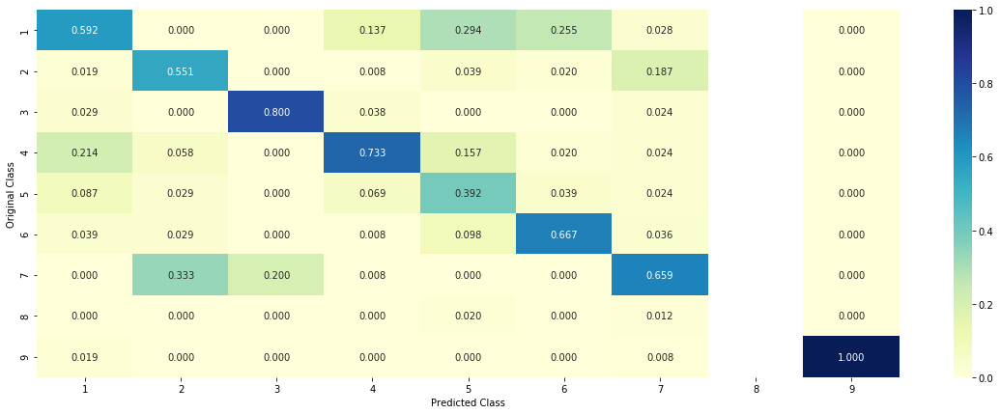


    -------------------- Recall matrix (Row sum=1) --------------------


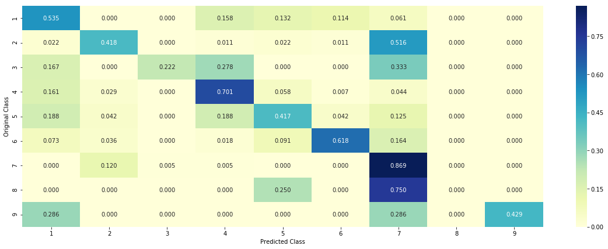


```python

```
